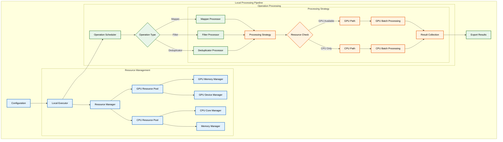

# Improved Local Mode Implementation

## Architecture Overview



## Implementation Details

### 1. Resource Management

#### GPU Resource Pool
```python
class GPUResourcePool:
    def __init__(self):
        self.available_gpus = []
        self.gpu_memory = {}
        self.gpu_utilization = {}
        
    def initialize(self):
        """Initialize GPU resources and memory tracking"""
        for i in range(torch.cuda.device_count()):
            self.available_gpus.append(i)
            self.gpu_memory[i] = torch.cuda.get_device_properties(i).total_memory
            self.gpu_utilization[i] = 0
            
    def allocate_gpu(self, required_memory):
        """Allocate GPU based on memory requirements"""
        for gpu_id in self.available_gpus:
            if self.gpu_memory[gpu_id] >= required_memory:
                return gpu_id
        return None
        
    def update_utilization(self, gpu_id, utilization):
        """Update GPU utilization tracking"""
        self.gpu_utilization[gpu_id] = utilization
```

#### CPU Resource Pool
```python
class CPUResourcePool:
    def __init__(self):
        self.available_cores = []
        self.core_utilization = {}
        self.memory_available = 0
        
    def initialize(self):
        """Initialize CPU resources"""
        self.available_cores = list(range(multiprocessing.cpu_count()))
        self.memory_available = psutil.virtual_memory().available
        
    def allocate_cores(self, required_cores):
        """Allocate CPU cores based on requirements"""
        if len(self.available_cores) >= required_cores:
            return self.available_cores[:required_cores]
        return None
```

### 2. Processing Strategy

#### Batch Size Optimizer
```python
class BatchSizeOptimizer:
    def __init__(self):
        self.min_batch_size = 1
        self.max_batch_size = 10000
        self.memory_safety_factor = 0.8
        
    def calculate_optimal_batch_size(self, operation, dataset_size):
        """Calculate optimal batch size based on multiple factors"""
        # Start with operation's preferred batch size
        batch_size = operation.batch_size if hasattr(operation, 'batch_size') else self.min_batch_size
        
        # Adjust based on available memory
        if operation.use_cuda():
            gpu_memory = torch.cuda.get_device_properties(0).total_memory
            safe_memory = gpu_memory * self.memory_safety_factor
            memory_based_size = int(safe_memory / operation.memory_required)
            batch_size = min(batch_size, memory_based_size)
        
        # Ensure batch size is within limits
        batch_size = max(self.min_batch_size, min(batch_size, self.max_batch_size))
        
        # Adjust based on dataset size
        batch_size = min(batch_size, dataset_size)
        
        return batch_size
```

#### Processing Strategy
```python
class ProcessingStrategy:
    def __init__(self, resource_pool):
        self.resource_pool = resource_pool
        self.batch_size_optimizer = BatchSizeOptimizer()
        
    def determine_processing_path(self, operation):
        """Determine optimal processing path based on operation and resources"""
        if operation.use_cuda():
            gpu_id = self.resource_pool.gpu_pool.allocate_gpu(
                operation.memory_required)
            if gpu_id is not None:
                return GPUProcessingPath(gpu_id)
        return CPUProcessingPath()
        
    def optimize_batch_size(self, operation, dataset_size):
        """Optimize batch size based on operation and dataset"""
        return self.batch_size_optimizer.calculate_optimal_batch_size(
            operation, dataset_size)
```

### 3. Batch Processing

```python
class BatchProcessor:
    def __init__(self, strategy):
        self.strategy = strategy
        self.error_handler = ErrorHandler()
        
    def process_batch(self, batch, operation):
        """Process a batch of data using the optimal strategy"""
        processing_path = self.strategy.determine_processing_path(operation)
        batch_size = self.strategy.optimize_batch_size(operation, len(batch))
        
        try:
            if isinstance(processing_path, GPUProcessingPath):
                return self._process_gpu_batch(batch, operation, processing_path)
            return self._process_cpu_batch(batch, operation, processing_path)
        except Exception as e:
            return self.error_handler.handle_error(e, batch, operation, processing_path)
            
    def _process_gpu_batch(self, batch, operation, path):
        """Process batch using GPU"""
        with torch.cuda.device(path.gpu_id):
            return operation.process_batched(batch)
            
    def _process_cpu_batch(self, batch, operation, path):
        """Process batch using CPU"""
        return operation.process_batched(batch)
```

### 4. Error Handling

```python
class ErrorHandler:
    def __init__(self):
        self.max_retries = 3
        self.retry_delay = 1  # seconds
        
    def handle_error(self, error, batch, operation, processing_path):
        """Handle processing errors with retry logic"""
        if isinstance(error, torch.cuda.OutOfMemoryError):
            return self._handle_oom_error(batch, operation, processing_path)
        elif isinstance(error, Exception):
            return self._handle_general_error(error, batch, operation)
            
    def _handle_oom_error(self, batch, operation, processing_path):
        """Handle out-of-memory errors"""
        # Try reducing batch size
        if processing_path.batch_size > 1:
            processing_path.batch_size //= 2
            return self._retry_processing(batch, operation, processing_path)
        # Fall back to CPU
        return self._fallback_to_cpu(batch, operation)
        
    def _handle_general_error(self, error, batch, operation):
        """Handle general processing errors"""
        logger.error(f"Error processing batch: {str(error)}")
        return self._retry_processing(batch, operation)
        
    def _retry_processing(self, batch, operation, processing_path=None):
        """Retry processing with exponential backoff"""
        for attempt in range(self.max_retries):
            try:
                if processing_path:
                    return self._process_with_path(batch, operation, processing_path)
                return operation.process_batched(batch)
            except Exception as e:
                if attempt == self.max_retries - 1:
                    raise
                time.sleep(self.retry_delay * (2 ** attempt))
```

## Usage Example

```python
# Initialize resource pools
gpu_pool = GPUResourcePool()
cpu_pool = CPUResourcePool()
gpu_pool.initialize()
cpu_pool.initialize()

# Create processing strategy
strategy = ProcessingStrategy(ResourcePool(gpu_pool, cpu_pool))
batch_processor = BatchProcessor(strategy)

# Process dataset
def process_dataset(dataset, operations):
    for operation in operations:
        batches = dataset.create_batches(
            batch_size=strategy.optimize_batch_size(operation, len(dataset)))
        results = []
        for batch in batches:
            result = batch_processor.process_batch(batch, operation)
            results.extend(result)
        dataset = Dataset.from_list(results)
    return dataset
```

## Key Features

1. **Dynamic Resource Allocation**
   - Intelligent GPU/CPU resource allocation
   - Memory-aware scheduling
   - Utilization tracking
   - Automatic resource rebalancing

2. **Adaptive Batch Processing**
   - Dynamic batch size optimization
   - Memory-aware batch sizing
   - Automatic fallback mechanisms
   - Performance monitoring

3. **Robust Error Handling**
   - Automatic error recovery
   - Graceful degradation
   - Retry mechanisms
   - Resource cleanup

4. **Performance Optimization**
   - Efficient resource utilization
   - Memory pooling
   - Parallel processing
   - Cache management

## Integration Guide

1. **Setup**
   ```python
   from data_juicer.core.local_mode import LocalModeExecutor
   
   executor = LocalModeExecutor(config)
   ```

2. **Configuration**
   ```python
   config = {
       'use_gpu': True,
       'adaptive_batch_size': True,
       'max_batch_size': 10000,
       'memory_safety_factor': 0.8,
       'error_handling': {
           'max_retries': 3,
           'retry_delay': 1
       }
   }
   ```

3. **Usage**
   ```python
   # Process dataset with operations
   result = executor.process_dataset(dataset, operations)
   
   # Monitor resource usage
   resource_stats = executor.get_resource_stats()
   ```

## Performance Considerations

1. **Memory Management**
   - Monitor GPU memory usage
   - Implement memory pooling
   - Use efficient data structures
   - Clean up resources promptly

2. **Batch Size Optimization**
   - Consider operation complexity
   - Account for available memory
   - Monitor processing speed
   - Adjust dynamically

3. **Error Recovery**
   - Implement retry mechanisms
   - Handle resource cleanup
   - Provide fallback options
   - Log error details

4. **Resource Monitoring**
   - Track GPU utilization
   - Monitor CPU usage
   - Log memory consumption
   - Profile performance 