```mermaid
graph TD
    %% Main Components
    subgraph "Local Processing Pipeline"
        A[Configuration] --> B[Default Executor]
        
        subgraph "Operation Processing"
            B --> C[Operation Handler]
            
            C --> D{Operation Type}
            D -->|Mapper| E[Mapper]
            D -->|Filter| F[Filter]
            D -->|Deduplicator| G[Deduplicator]
            
            subgraph "Resource Management"
                E --> H{Use GPU?}
                F --> H
                G --> H
                
                H -->|Yes| I[GPU Memory Check]
                H -->|No| J[CPU Processing]
                
                I --> K{Memory Sufficient?}
                K -->|Yes| L[GPU Processing]
                K -->|No| M[Memory Optimization]
                M --> N[Adjust Batch Size]
                N --> L
            end
            
            L --> O[Process Data]
            J --> O
            
            O --> P{Use Batching?}
            P -->|Yes| Q[Batch Processing]
            P -->|No| R[Single Item Processing]
            
            Q --> S[Result Collection]
            R --> S
        end
        
        S --> T[Export Results]
    end
    
    %% Styling
    classDef default fill:#f9f9f9,stroke:#333,stroke-width:2px;
    classDef operation fill:#e1f5fe,stroke:#01579b,stroke-width:2px;
    classDef resource fill:#e8f5e9,stroke:#2e7d32,stroke-width:2px;
    classDef processing fill:#fff3e0,stroke:#e65100,stroke-width:2px;
    
    class A,B default;
    class C,D,E,F,G operation;
    class H,I,J,K,L,M,N resource;
    class O,P,Q,R,S processing;
```

# Local Processing Pipeline

This diagram shows the integrated operation processing and resource management in Data-Juicer's local processing pipeline.

## Key Components

### Operation Processing
- Supports multiple operation types:
  - Mapper
  - Filter
  - Deduplicator
- Each operation can use either GPU or CPU processing
- Batch processing is optional and can be enabled/disabled

### Resource Management
- Integrated with operation processing
- GPU availability and memory checks
- Dynamic resource allocation
- Optional batch size optimization

### Processing Flow
- Flexible processing paths:
  - GPU processing with memory optimization
  - CPU processing
  - Batch or single-item processing
- Result collection and export

## Color Coding
- Default components (light gray)
- Operation handling (light blue)
- Resource management (light green)
- Processing components (light orange)
