```mermaid
graph TD
    %% Main Components
    subgraph "Ray Distributed Processing"
        A[Configuration] --> B[Ray Executor]
        
        subgraph "Ray Cluster Management"
            B --> C[Ray Init]
            C --> D[Cluster Setup]
            D --> E[Resource Allocation]
        end
        
        subgraph "RayDataset Processing"
            E --> F[RayDataset]
            
            F --> G{Operation Type}
            G -->|Mapper| H[Ray Mapper]
            G -->|Filter| I[Ray Filter]
            G -->|Deduplicator| J[Ray Deduplicator]
            
            subgraph "Distributed Resource Management"
                H --> K[GPU Resource Check]
                I --> K
                J --> K
                
                K --> L{GPU Available?}
                L -->|Yes| M[GPU Memory Check]
                L -->|No| N[CPU Processing]
                
                M --> O{Memory Sufficient?}
                O -->|Yes| P[GPU Batch Processing]
                O -->|No| Q[Memory Optimization]
                Q --> R[Adjust Batch Size]
                R --> P
                
                N --> S[CPU Processing]
                S --> T{Use Batching?}
                T -->|Yes| U[CPU Batch Processing]
                T -->|No| V[CPU Single Item]
            end
            
            P --> W[Process Data]
            U --> W
            V --> W
            
            W --> X[Result Collection]
            X --> Y[Export Results]
        end
    end
    
    %% Styling
    classDef default fill:#ffffff,stroke:#000000,stroke-width:2px,color:#000000;
    classDef ray fill:#e3f2fd,stroke:#1565c0,stroke-width:2px,color:#000000;
    classDef dataset fill:#e8f5e9,stroke:#2e7d32,stroke-width:2px,color:#000000;
    classDef resource fill:#fff3e0,stroke:#e65100,stroke-width:2px,color:#000000;
    classDef processing fill:#f3e5f5,stroke:#6a1b9a,stroke-width:2px,color:#000000;
    
    class A,B,C,D,E ray;
    class F,G,H,I,J dataset;
    class K,L,M,N,O,P,Q,R,S,T,U,V resource;
    class W,X,Y processing;
```

# Ray Distributed Processing Architecture

This diagram illustrates the Ray-based distributed processing architecture in Data-Juicer, focusing on the Ray executor and RayDataset components.

## Key Components

### Ray Cluster Management
- Ray initialization and setup
- Cluster resource allocation
- Distributed processing coordination

### RayDataset Processing
- Distributed dataset handling
- Support for multiple operation types:
  - Ray Mapper
  - Ray Filter
  - Ray Deduplicator
- Distributed resource management

### Resource Management
- Distributed GPU resource checking
- Memory management across nodes
- Batch processing optimization
- CPU/GPU path selection

### Processing Flow
- Distributed data processing
- Result collection and aggregation
- Export handling

## Color Coding
- Default components (white with black border)
- Ray components (light blue with dark blue border)
- Dataset components (light green with dark green border)
- Resource management (light orange with dark orange border)
- Processing components (light purple with dark purple border) 