```mermaid
graph TD
    %% Main Components
    subgraph "Data-Juicer System"
        A[Configuration] --> B[Executor Selection]
        B --> C{Executor Type}
        
        subgraph "Default Executor"
            C -->|Local| D[DefaultExecutor]
            D --> D1[Local Processing]
            D1 --> D2[Operation Processing]
            D2 --> D3[Result Export]
        end
        
        subgraph "Ray Executor"
            C -->|Distributed| E[RayExecutor]
            E --> E1[Ray Cluster Init]
            E1 --> E2[Distributed Processing]
            E2 --> E3[Result Export]
        end
        
        subgraph "Operation Processing"
            D2 --> F[Operation Handler]
            E2 --> F
            
            F --> G{Operation Type}
            G -->|Mapper| H[GPU Mapper]
            G -->|Filter| I[GPU Filter]
            G -->|Deduplicator| J[GPU Deduplicator]
            
            subgraph "GPU Resource Management"
                H --> K[GPU Resource Allocator]
                I --> K
                J --> K
                
                K --> L{GPU Available?}
                L -->|Yes| M[GPU Processing]
                L -->|No| N[CPU Processing]
                
                M --> O[Batch Processing]
                N --> O
            end
            
            subgraph "Resource Calculation"
                K --> P[Resource Calculator]
                P --> Q[Memory Check]
                Q --> R[Resource Allocation]
            end
            
            subgraph "Error Handling"
                O --> S[Error Handler]
                S --> T{Recoverable?}
                T -->|Yes| U[Retry with CPU]
                T -->|No| V[Fail Operation]
            end
        end
        
        subgraph "Dataset Processing"
            D1 --> W[Dataset Handler]
            E1 --> W
            
            W --> X[Batch Management]
            X --> Y[Data Processing]
            Y --> Z[Result Collection]
        end
    end
    
    %% Styling
    classDef default fill:#f9f9f9,stroke:#333,stroke-width:2px;
    classDef executor fill:#e1f5fe,stroke:#01579b,stroke-width:2px;
    classDef gpu fill:#e8f5e9,stroke:#2e7d32,stroke-width:2px;
    classDef error fill:#ffebee,stroke:#c62828,stroke-width:2px;
    classDef resource fill:#fff3e0,stroke:#e65100,stroke-width:2px;
    
    class A,B,C default;
    class D,E executor;
    class H,I,J,M gpu;
    class S,T,U,V error;
    class K,L,P,Q,R resource;
```

# Data-Juicer GPU Processing System Architecture

This diagram illustrates the architecture of Data-Juicer's GPU-enabled processing system, showing how data flows through different components and how GPU resources are managed.

## Key Components

### Executors
- **Default Executor**: Handles local processing
- **Ray Executor**: Manages distributed processing across nodes

### Operation Processing
- Supports multiple operation types (Mapper, Filter, Deduplicator)
- GPU resource management and allocation
- Error handling and recovery mechanisms

### Resource Management
- Dynamic GPU resource allocation
- Memory management and optimization
- Resource calculation and monitoring

### Dataset Processing
- Batch management
- Data processing pipeline
- Result collection and export

## Color Coding
- Default components (light gray)
- Executor components (light blue)
- GPU-related components (light green)
- Error handling (light red)
- Resource management (light orange)
