# Improved Local Mode Implementation

## Architecture Overview

```mermaid
graph TD
    %% Main Components
    subgraph "Local Processing Pipeline"
        A[Configuration] --> B[Local Executor]
        
        subgraph "Resource Management"
            B --> C[Resource Manager]
            C --> D[GPU Resource Pool]
            C --> E[CPU Resource Pool]
            
            D --> F[GPU Memory Manager]
            D --> G[GPU Device Manager]
            
            E --> H[CPU Core Manager]
            E --> I[Memory Manager]
        end
        
        subgraph "Operation Processing"
            B --> J[Operation Scheduler]
            
            J --> K{Operation Type}
            K -->|Mapper| L[Mapper Processor]
            K -->|Filter| M[Filter Processor]
            K -->|Deduplicator| N[Deduplicator Processor]
            
            subgraph "Processing Strategy"
                L --> O[Processing Strategy]
                M --> O
                N --> O
                
                O --> P{Resource Check}
                P -->|GPU Available| Q[GPU Path]
                P -->|CPU Only| R[CPU Path]
                
                Q --> S[GPU Batch Processing]
                R --> T[CPU Batch Processing]
                
                S --> U[Result Collection]
                T --> U
            end
        end
        
        subgraph "Resource Monitoring"
            U --> V[Performance Monitor]
            V --> W[Resource Usage Analyzer]
            W --> X[Resource Manager]
            X --> C
        end
    end
    
    %% Styling
    classDef default fill:#ffffff,stroke:#000000,stroke-width:2px,color:#000000;
    classDef resource fill:#e3f2fd,stroke:#1565c0,stroke-width:2px,color:#000000;
    classDef processing fill:#e8f5e9,stroke:#2e7d32,stroke-width:2px,color:#000000;
    classDef strategy fill:#fff3e0,stroke:#e65100,stroke-width:2px,color:#000000;
    classDef monitor fill:#fce4ec,stroke:#c2185b,stroke-width:2px,color:#000000;
    
    class A,B resource;
    class C,D,E,F,G,H,I resource;
    class J,K,L,M,N processing;
    class O,P,Q,R,S,T,U strategy;
    class V,W,X monitor;
```




## Implementation Details

### 1. Resource Management with Monitoring Integration

```python
class ResourceManager:
    def __init__(self):
        self.gpu_pool = GPUResourcePool()
        self.cpu_pool = CPUResourcePool()
        self.monitor = ResourceMonitor()
        self.analyzer = ResourceUsageAnalyzer()
        
    def initialize(self):
        """Initialize all resource pools and monitoring"""
        self.gpu_pool.initialize()
        self.cpu_pool.initialize()
        self.monitor.start_monitoring()
        
    def allocate_resources(self, operation):
        """Allocate resources based on operation requirements and current usage"""
        # Get current resource usage
        current_usage = self.monitor.get_current_usage()
        
        # Analyze resource requirements
        requirements = self.analyzer.analyze_requirements(operation, current_usage)
        
        # Allocate resources
        if operation.use_cuda():
            gpu_id = self.gpu_pool.allocate_gpu(requirements.gpu_memory)
            if gpu_id is not None:
                return ResourceAllocation(
                    gpu_id=gpu_id,
                    batch_size=self._calculate_optimal_batch_size(operation, gpu_id)
                )
        
        # Fallback to CPU
        cpu_cores = self.cpu_pool.allocate_cores(requirements.cpu_cores)
        return ResourceAllocation(
            cpu_cores=cpu_cores,
            batch_size=self._calculate_optimal_batch_size(operation, None)
        )
        
    def _calculate_optimal_batch_size(self, operation, gpu_id):
        """Calculate optimal batch size based on resource availability"""
        if gpu_id is not None:
            available_memory = self.gpu_pool.get_available_memory(gpu_id)
            return min(
                operation.batch_size,
                int(available_memory * 0.8 / operation.memory_required)
            )
        return operation.batch_size
        
    def update_resource_usage(self, operation_id, usage_stats):
        """Update resource usage statistics"""
        self.monitor.update_stats(operation_id, usage_stats)
        self.analyzer.update_analysis(operation_id, usage_stats)
```

### 2. Resource Monitoring

```python
class ResourceMonitor:
    def __init__(self):
        self.usage_history = {}
        self.current_usage = {}
        self.monitoring_thread = None
        self.stop_event = threading.Event()
        
    def start_monitoring(self):
        """Start resource monitoring in background thread"""
        self.monitoring_thread = threading.Thread(
            target=self._monitor_resources,
            daemon=True
        )
        self.monitoring_thread.start()
        
    def _monitor_resources(self):
        """Monitor resource usage continuously"""
        while not self.stop_event.is_set():
            # Monitor GPU usage
            for gpu_id in range(torch.cuda.device_count()):
                with torch.cuda.device(gpu_id):
                    self.current_usage[f'gpu_{gpu_id}_memory'] = (
                        torch.cuda.memory_allocated() / torch.cuda.max_memory_allocated()
                    )
                    self.current_usage[f'gpu_{gpu_id}_utilization'] = (
                        torch.cuda.utilization()
                    )
            
            # Monitor CPU usage
            self.current_usage['cpu_percent'] = psutil.cpu_percent(interval=1)
            self.current_usage['memory_percent'] = psutil.virtual_memory().percent
            
            time.sleep(1)  # Update every second
            
    def get_current_usage(self):
        """Get current resource usage statistics"""
        return self.current_usage.copy()
        
    def update_stats(self, operation_id, usage_stats):
        """Update usage statistics for an operation"""
        if operation_id not in self.usage_history:
            self.usage_history[operation_id] = []
        self.usage_history[operation_id].append(usage_stats)
```

### 3. Resource Usage Analysis

```python
class ResourceUsageAnalyzer:
    def __init__(self):
        self.operation_profiles = {}
        self.resource_patterns = {}
        
    def analyze_requirements(self, operation, current_usage):
        """Analyze resource requirements for an operation"""
        # Get historical profile if available
        profile = self.operation_profiles.get(operation._name)
        
        if profile:
            # Use historical data to predict requirements
            return self._predict_requirements(profile, current_usage)
        else:
            # Use operation's declared requirements
            return ResourceRequirements(
                gpu_memory=operation.memory_required,
                cpu_cores=operation.cpu_required
            )
            
    def update_analysis(self, operation_id, usage_stats):
        """Update analysis with new usage statistics"""
        operation_name = usage_stats['operation_name']
        
        if operation_name not in self.operation_profiles:
            self.operation_profiles[operation_name] = {
                'memory_usage': [],
                'cpu_usage': [],
                'batch_sizes': [],
                'processing_times': []
            }
            
        profile = self.operation_profiles[operation_name]
        profile['memory_usage'].append(usage_stats['memory_usage'])
        profile['cpu_usage'].append(usage_stats['cpu_usage'])
        profile['batch_sizes'].append(usage_stats['batch_size'])
        profile['processing_times'].append(usage_stats['processing_time'])
        
        # Update resource patterns
        self._update_resource_patterns(operation_name, usage_stats)
        
    def _predict_requirements(self, profile, current_usage):
        """Predict resource requirements based on historical data"""
        # Calculate average memory usage
        avg_memory = np.mean(profile['memory_usage'])
        # Add safety margin
        predicted_memory = avg_memory * 1.2
        
        # Calculate CPU requirements
        avg_cpu = np.mean(profile['cpu_usage'])
        predicted_cores = int(np.ceil(avg_cpu / 100 * multiprocessing.cpu_count()))
        
        return ResourceRequirements(
            gpu_memory=predicted_memory,
            cpu_cores=predicted_cores
        )
```

### 4. Processing Integration

```python
class BatchProcessor:
    def __init__(self, resource_manager):
        self.resource_manager = resource_manager
        self.error_handler = ErrorHandler()
        
    def process_batch(self, batch, operation):
        """Process a batch with resource management integration"""
        # Get resource allocation
        allocation = self.resource_manager.allocate_resources(operation)
        
        try:
            # Start monitoring for this operation
            operation_id = f"{operation._name}_{time.time()}"
            self.resource_manager.monitor.start_operation_monitoring(operation_id)
            
            # Process the batch
            if allocation.gpu_id is not None:
                result = self._process_gpu_batch(batch, operation, allocation)
            else:
                result = self._process_cpu_batch(batch, operation, allocation)
                
            # Update resource usage statistics
            usage_stats = self.resource_manager.monitor.get_operation_stats(operation_id)
            self.resource_manager.update_resource_usage(operation_id, usage_stats)
            
            return result
            
        except Exception as e:
            return self.error_handler.handle_error(e, batch, operation, allocation)
            
    def _process_gpu_batch(self, batch, operation, allocation):
        """Process batch using GPU with resource management"""
        with torch.cuda.device(allocation.gpu_id):
            # Set batch size based on allocation
            operation.batch_size = allocation.batch_size
            return operation.process_batched(batch)
            
    def _process_cpu_batch(self, batch, operation, allocation):
        """Process batch using CPU with resource management"""
        # Set number of CPU cores based on allocation
        operation.num_proc = len(allocation.cpu_cores)
        return operation.process_batched(batch)
```

## Usage Example

```python
# Initialize resource manager with monitoring
resource_manager = ResourceManager()
resource_manager.initialize()

# Create batch processor
batch_processor = BatchProcessor(resource_manager)

# Process dataset with resource management
def process_dataset(dataset, operations):
    for operation in operations:
        # Get initial resource allocation
        allocation = resource_manager.allocate_resources(operation)
        
        # Create batches with optimal size
        batches = dataset.create_batches(batch_size=allocation.batch_size)
        
        results = []
        for batch in batches:
            result = batch_processor.process_batch(batch, operation)
            results.extend(result)
            
        dataset = Dataset.from_list(results)
    return dataset
```

## Key Features

1. **Integrated Resource Management**
   - Real-time resource monitoring
   - Dynamic resource allocation
   - Usage pattern analysis
   - Predictive resource requirements

2. **Adaptive Processing**
   - Dynamic batch size adjustment
   - Resource-aware scheduling
   - Performance optimization
   - Automatic fallback mechanisms

3. **Comprehensive Monitoring**
   - GPU memory and utilization tracking
   - CPU usage monitoring
   - Operation-level statistics
   - Resource usage patterns

4. **Performance Optimization**
   - Historical data analysis
   - Resource usage prediction
   - Batch size optimization
   - Resource rebalancing

## Integration Guide

1. **Setup**
   ```python
   from data_juicer.core.local_mode import LocalModeExecutor
   
   config = {
       'resource_management': {
           'monitoring_interval': 1.0,
           'memory_safety_factor': 0.8,
           'cpu_safety_factor': 0.7
       },
       'batch_processing': {
           'adaptive_batch_size': True,
           'max_batch_size': 10000
       }
   }
   
   executor = LocalModeExecutor(config)
   ```

2. **Monitoring**
   ```python
   # Get current resource usage
   usage = executor.get_resource_usage()
   
   # Get operation statistics
   stats = executor.get_operation_stats('operation_name')
   
   # Get resource patterns
   patterns = executor.get_resource_patterns()
   ```

3. **Resource Management**
   ```python
   # Set resource limits
   executor.set_resource_limits(
       gpu_memory_limit='8GB',
       cpu_cores_limit=4
   )
   
   # Get resource allocation
   allocation = executor.allocate_resources(operation)
   ```

## Performance Considerations

1. **Resource Monitoring**
   - Monitor GPU memory and utilization
   - Track CPU usage and core allocation
   - Analyze operation patterns
   - Predict resource requirements

2. **Batch Processing**
   - Optimize batch sizes based on resources
   - Monitor processing performance
   - Adjust based on resource availability
   - Handle resource constraints

3. **Error Handling**
   - Monitor resource-related errors
   - Implement automatic recovery
   - Provide fallback options
   - Log detailed error information

4. **Resource Optimization**
   - Analyze usage patterns
   - Optimize resource allocation
   - Implement predictive scaling
   - Monitor performance metrics 