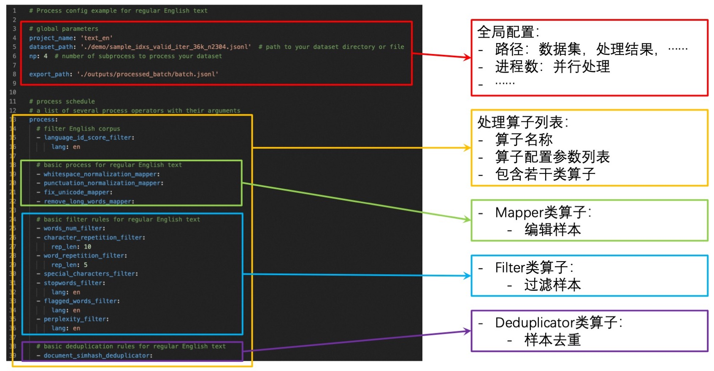

[**English**](https://github.com/alibaba/data-juicer) | 中文

# Data-Juicer: 为大语言模型提供更高质量、更丰富、更易“消化”的数据


[](docs/DeveloperGuide_ZH.md)

[](README.md#documentation)
[](README_ZH.md#documentation)
[](https://alibaba.github.io/data-juicer/)
[![ModelScope-10+ Demos](https://img.shields.io/badge/ModelScope-10+_Demos-4e29ff.svg?logo=data:image/svg+xml;base64,PHN2ZyB2aWV3Qm94PSIwIDAgMjI0IDEyMS4zMyIgeG1sbnM9Imh0dHA6Ly93d3cudzMub3JnLzIwMDAvc3ZnIj4KCTxwYXRoIGQ9Im0wIDQ3Ljg0aDI1LjY1djI1LjY1aC0yNS42NXoiIGZpbGw9IiM2MjRhZmYiIC8+Cgk8cGF0aCBkPSJtOTkuMTQgNzMuNDloMjUuNjV2MjUuNjVoLTI1LjY1eiIgZmlsbD0iIzYyNGFmZiIgLz4KCTxwYXRoIGQ9Im0xNzYuMDkgOTkuMTRoLTI1LjY1djIyLjE5aDQ3Ljg0di00Ny44NGgtMjIuMTl6IiBmaWxsPSIjNjI0YWZmIiAvPgoJPHBhdGggZD0ibTEyNC43OSA0Ny44NGgyNS42NXYyNS42NWgtMjUuNjV6IiBmaWxsPSIjMzZjZmQxIiAvPgoJPHBhdGggZD0ibTAgMjIuMTloMjUuNjV2MjUuNjVoLTI1LjY1eiIgZmlsbD0iIzM2Y2ZkMSIgLz4KCTxwYXRoIGQ9Im0xOTguMjggNDcuODRoMjUuNjV2MjUuNjVoLTI1LjY1eiIgZmlsbD0iIzYyNGFmZiIgLz4KCTxwYXRoIGQ9Im0xOTguMjggMjIuMTloMjUuNjV2MjUuNjVoLTI1LjY1eiIgZmlsbD0iIzM2Y2ZkMSIgLz4KCTxwYXRoIGQ9Im0xNTAuNDQgMHYyMi4xOWgyNS42NXYyNS42NWgyMi4xOXYtNDcuODR6IiBmaWxsPSIjNjI0YWZmIiAvPgoJPHBhdGggZD0ibTczLjQ5IDQ3Ljg0aDI1LjY1djI1LjY1aC0yNS42NXoiIGZpbGw9IiMzNmNmZDEiIC8+Cgk8cGF0aCBkPSJtNDcuODQgMjIuMTloMjUuNjV2LTIyLjE5aC00Ny44NHY0Ny44NGgyMi4xOXoiIGZpbGw9IiM2MjRhZmYiIC8+Cgk8cGF0aCBkPSJtNDcuODQgNzMuNDloLTIyLjE5djQ3Ljg0aDQ3Ljg0di0yMi4xOWgtMjUuNjV6IiBmaWxsPSIjNjI0YWZmIiAvPgo8L3N2Zz4K)](#demos)
[![ModelScope-20+_Refined_Datasets](https://img.shields.io/badge/ModelScope-20+_Refined_Datasets-4e29ff.svg?logo=data:image/svg+xml;base64,PHN2ZyB2aWV3Qm94PSIwIDAgMjI0IDEyMS4zMyIgeG1sbnM9Imh0dHA6Ly93d3cudzMub3JnLzIwMDAvc3ZnIj4KCTxwYXRoIGQ9Im0wIDQ3Ljg0aDI1LjY1djI1LjY1aC0yNS42NXoiIGZpbGw9IiM2MjRhZmYiIC8+Cgk8cGF0aCBkPSJtOTkuMTQgNzMuNDloMjUuNjV2MjUuNjVoLTI1LjY1eiIgZmlsbD0iIzYyNGFmZiIgLz4KCTxwYXRoIGQ9Im0xNzYuMDkgOTkuMTRoLTI1LjY1djIyLjE5aDQ3Ljg0di00Ny44NGgtMjIuMTl6IiBmaWxsPSIjNjI0YWZmIiAvPgoJPHBhdGggZD0ibTEyNC43OSA0Ny44NGgyNS42NXYyNS42NWgtMjUuNjV6IiBmaWxsPSIjMzZjZmQxIiAvPgoJPHBhdGggZD0ibTAgMjIuMTloMjUuNjV2MjUuNjVoLTI1LjY1eiIgZmlsbD0iIzM2Y2ZkMSIgLz4KCTxwYXRoIGQ9Im0xOTguMjggNDcuODRoMjUuNjV2MjUuNjVoLTI1LjY1eiIgZmlsbD0iIzYyNGFmZiIgLz4KCTxwYXRoIGQ9Im0xOTguMjggMjIuMTloMjUuNjV2MjUuNjVoLTI1LjY1eiIgZmlsbD0iIzM2Y2ZkMSIgLz4KCTxwYXRoIGQ9Im0xNTAuNDQgMHYyMi4xOWgyNS42NXYyNS42NWgyMi4xOXYtNDcuODR6IiBmaWxsPSIjNjI0YWZmIiAvPgoJPHBhdGggZD0ibTczLjQ5IDQ3Ljg0aDI1LjY1djI1LjY1aC0yNS42NXoiIGZpbGw9IiMzNmNmZDEiIC8+Cgk8cGF0aCBkPSJtNDcuODQgMjIuMTloMjUuNjV2LTIyLjE5aC00Ny44NHY0Ny44NGgyMi4xOXoiIGZpbGw9IiM2MjRhZmYiIC8+Cgk8cGF0aCBkPSJtNDcuODQgNzMuNDloLTIyLjE5djQ3Ljg0aDQ3Ljg0di0yMi4xOWgtMjUuNjV6IiBmaWxsPSIjNjI0YWZmIiAvPgo8L3N2Zz4K)](#data-recipes)

[](tools/quality_classifier/README_ZH.md)
[](tools/evaluator/README_ZH.md)

Data-Juicer 是一个以数据为中心的文本处理系统，旨在为大语言模型 (LLM) 提供更高质量、更丰富、更易“消化”的数据。
本项目在积极更新和维护中，我们将定期强化和新增更多的功能和数据菜谱。欢迎您加入我们推进 LLM 数据的开发和研究工作！

----

目录
===

* [Data-Juicer: 为大语言模型提供更高质量、更丰富、更易“消化”的数据](#data-juicer-为大语言模型提供更高质量更丰富更易消化的数据)
* [目录](#目录)
  * [特点](#特点)
  * [前置条件](#前置条件)
  * [安装](#安装)
  * [快速上手](#快速上手)
    * [数据处理](#数据处理)
    * [数据分析](#数据分析)
    * [数据可视化](#数据可视化)
    * [构建配置文件](#构建配置文件)
    * [预处理原始数据（可选）](#预处理原始数据可选)
  * [Documentation | 文档](#documentation)
  * [数据处理菜谱](#数据处理菜谱)
  * [演示样例](#演示样例)
  * [开源协议](#开源协议)
  * [贡献](#贡献)
  * [参考文献](#参考文献)

## 特点

* **丰富的算子**：内置了 50 多个核心 [算子(OPs)](docs/Operators_ZH.md)，包括 Formatters，Mappers，Filters，Deduplicators 等。

* **专业的工具库**：提供功能丰富的专业工具库，例如 [文本质量打分器](tools/quality_classifier/README_ZH.md)，[数据分割器](tools/preprocess/README_ZH.md)，[分析器](#数据分析)，[评估器](tools/evaluator/README_ZH.md) 等，提升您的数据处理能力。

* **系统化 & 可复用**：为用户提供系统化且可复用的[配置菜谱](configs/README_ZH.md)和[算子库](docs/Operators_ZH.md)，旨在让数据处理独立于特定的数据集、模型或任务运行。

* **数据反馈回路**：支持详细的数据分析，并提供自动报告生成功能，使您深入了解您的数据集。结合实时多维度自动评估功能，支持在 LLM 开发过程的多个阶段进行反馈循环。

* **全面的处理菜谱**：为预训练、SFT、中英文等场景提供数十种[预构建的数据处理菜谱](configs/refine_recipe/README_ZH.md)。

* **用户友好**：设计简单易用，提供全面的[文档](#documentation)、简易[入门指南](#快速上手)和[演示配置](configs/README_ZH.md)，并且可以轻松地添加/删除[现有配置](configs/config_all.yaml)中的算子。

* **灵活 & 易扩展**：支持大多数数据格式（如jsonl、parquet、csv等），并允许灵活组合算子。支持[自定义算子](docs/DeveloperGuide_ZH.md#构建自己的算子)，以执行定制化的数据处理。

* **效率增强**：提供高效的数据处理流水线，减少内存占用，提高生产力。

## 前置条件

* 推荐 Python==3.8
* gcc >= 5 (at least C++14 support)

## 安装

* 运行以下命令以安装 `data_juicer` 可编辑模式的最新版本

```shell
cd <path_to_data_juicer>
pip install -v -e .[all]
```

* 或是安装可选的依赖项:

```shell
cd <path_to_data_juicer>
pip install -v -e .  # 安装最小依赖
pip install -v -e .[tools] # 安装部分工具库的依赖
```

依赖选项如下表所示:

| 标签      | 描述                                          |
|----------|----------------------------------------------|
| .        | 安装支持 Data-Juicer 基础功能的最小依赖项         |
| .[all]   | 安装所有可选依赖项（即下面所有依赖项）             |
| .[dev]   | 安装作为贡献者开发 Data-Juicer 所需的依赖项       |
| .[tools] | 安装专用工具库（如质量分类器）所需的依赖项          |

* 核验安装是否成功:

```python
import data_juicer as dj
print(dj.__version__)
```

## 快速上手

### 数据处理

* 以配置文件路径作为参数来运行 `process_data.py` 来处理数据集。

```shell
python tools/process_data.py --config configs/demo/process.yaml
```

* **注意**：使用未保存在本地的第三方模型或资源的算子第一次运行可能会很慢，因为这些算子需要将相应的资源下载到缓存目录中。默认的下载缓存目录为`~/.cache/data_juicer`。您可通过设置 shell 环境变量 `DATA_JUICER_CACHE_HOME` 更改缓存目录位置，您也可以通过同样的方式更改 `DATA_JUICER_MODELS_CACHE` 或 `DATA_JUICER_ASSETS_CACHE` 来分别修改模型缓存或资源缓存目录:

```shell
# 缓存主目录
export DATA_JUICER_CACHE_HOME="/path/to/another/directory"
# 模型缓存目录
export DATA_JUICER_MODELS_CACHE="/path/to/another/directory/models"
# 资源缓存目录
export DATA_JUICER_ASSETS_CACHE="/path/to/another/directory/assets"
```

### 数据分析

- 以配置文件路径为参数运行 `analyze_data.py` 来分析数据集。

```shell
python tools/analyze_data.py --config configs/demo/analyser.yaml
```

* **注意**：Analyser 只计算 Filter 算子的状态，其他的算子（例如 Mapper 和 Deduplicator）会在分析过程中被忽略。

### 数据可视化

* 运行 `app.py` 来在浏览器中可视化您的数据集。

```shell
streamlit run app.py
```

### 构建配置文件

* 配置文件包含一系列全局参数和用于数据处理的算子列表。您需要设置:
  * 全局参数：输入/输出 数据集路径，worker 进程数量等。
  * 算子列表：列出用于处理数据集的算子及其参数。
* 您可以通过如下方式构建自己的配置文件:
  * ➖：修改我们的样例配置文件 [`config_all.yaml`](configs/config_all.yaml)。该文件包含了**所有**算子以及算子对应的默认参数。您只需要**移除**不需要的算子并重新设置部分算子的参数即可。
  * ➕：从头开始构建自己的配置文件。您可以参考我们提供的样例配置文件 [`config_all.yaml`](configs/config_all.yaml)，[算子文档](docs/Operators_ZH.md)，以及 [开发者指南](docs/DeveloperGuide_ZH.md#构建自己的算子).
  * 除了使用 yaml 文件外，您还可以在命令行上指定一个或多个参数，这些参数将覆盖 yaml 文件中的值。

```shell
python xxx.py --config configs/demo/process.yaml --language_id_score_filter.lang=en
```

* 基础的配置项格式及定义如下图所示

  

### 预处理原始数据（可选）

* 我们的 Formatter 目前支持一些常见的输入数据集格式：
  * 单个文件中包含多个样本：jsonl/json、parquet、csv/tsv 等。
  * 单个文件中包含单个样本：txt、code、docx、pdf 等。
* 但来自不同源的数据是复杂和多样化的，例如:
  * [从 S3 下载的 arxiv 原始数据](https://info.arxiv.org/help/bulk_data_s3.html) 包括数千个 tar 文件以及更多的 gzip 文件，并且所需的 tex 文件在 gzip 文件中，很难直接获取。
  * 一些爬取的数据包含不同类型的文件（pdf、html、docx 等），并且很难提取额外的信息，例如表格、图表等。
* Data-Juicer 不可能处理所有类型的数据，欢迎提 Issues/PRs，贡献对新数据类型的处理能力！
* 因此我们在 [`tools/preprocess`](tools/preprocess) 中提供了一些**常见的预处理工具**，用于预处理这些类型各异的数据。
  * 欢迎您为社区贡献新的预处理工具。
  * 我们**强烈建议**将复杂的数据预处理为 jsonl 或 parquet 文件。

## Documentation | 文档 <a name="documentation"/>

* [Overview](README.md) | [概览](README_ZH.md)
* [Operator Zoo](docs/Operators.md) | [算子库](docs/Operators_ZH.md)
* [Configs](configs/README.md) | [配置系统](configs/README_ZH.md)
* [Developer Guide](docs/DeveloperGuide.md) | [开发者指南](docs/DeveloperGuide_ZH.md)
* Dedicated Toolkits | 专用工具箱
  * [Quality Classifier](tools/quality_classifier/README.md) | [质量分类器](tools/quality_classifier/README_ZH.md)
  * [Auto Evaluation](tools/evaluator/README.md) | [自动评测](tools/evaluator/README_ZH.md)
  * [Preprocess](tools/preprocess/README.md) | [前处理](tools/preprocess/README_ZH.md)
  * [Postprocess](tools/postprocess/README.md) | [后处理](tools/postprocess/README_ZH.md)
* [Third-parties (LLM Ecosystems)](thirdparty/README.md) | [第三方库（大语言模型生态）](thirdparty/README_ZH.md)
* [API references](https://alibaba.github.io/data-juicer/)

## 数据处理菜谱

* [BLOOM 数据处理菜谱](configs/bloom/README_ZH.md)
* [RedPajama 数据处理菜谱](configs/redpajama/README_ZH.md)
* [预训练数据增强菜谱](configs/refine_recipe/README_ZH.md)
* [SFT数据增强菜谱](configs/refine_recipe/README_ZH.md#L32)

## 演示样例

* Data-Juicer 介绍 [[ModelScope](https://modelscope.cn/studios/Data-Juicer/overview_scan/summary)]
* 数据可视化:
  * 基础指标统计 [[ModelScope](https://modelscope.cn/studios/Data-Juicer/data_visulization_statistics/summary)]
  * 词汇多样性 [[ModelScope](https://modelscope.cn/studios/Data-Juicer/data_visulization_diversity/summary)]
  * 算子效果 [[ModelScope](https://modelscope.cn/studios/Data-Juicer/data_visulization_op_effect/summary)]
* 数据处理:
  * 科学文献 (例如 [ArXiv](https://info.arxiv.org/help/bulk_data_s3.html)) [[ModelScope](https://modelscope.cn/studios/Data-Juicer/process_sci_data/summary)]
  * 编程代码 (例如 [TheStack](https://huggingface.co/datasets/bigcode/the-stack)) [[ModelScope](https://modelscope.cn/studios/Data-Juicer/process_code_data/summary)]
  * 中文指令数据 (例如 [Alpaca-CoT](https://huggingface.co/QingyiSi/Alpaca-CoT)) [[ModelScope](https://modelscope.cn/studios/Data-Juicer/sft_data_zh/summary)]
* 工具池:
  * CommonCrawl 质量分类器 [[ModelScope](https://modelscope.cn/studios/Data-Juicer/tool_quality_classifier/summary)]
  * 基于 [HELM](https://github.com/stanford-crfm/helm) 的自动评测 [[ModelScope](https://modelscope.cn/studios/Data-Juicer/auto_evaluation_helm/summary)]
  * 数据采样及混合 [[ModelScope](https://modelscope.cn/studios/Data-Juicer/data_mixture/summary)]
* 数据处理回路 [[ModelScope](https://modelscope.cn/studios/Data-Juicer/data_process_loop/summary)]
* 数据处理 HPO [[ModelScope](https://modelscope.cn/studios/Data-Juicer/data_process_hpo/summary)]

## 开源协议

Data-Juicer 在 Apache License 2.0 协议下发布。

## 贡献

我们非常欢迎贡献新功能、修复漏洞以及讨论。请参考[开发者指南](docs/DeveloperGuide_ZH.md)。

## 参考文献

我们的论文即将发布！
