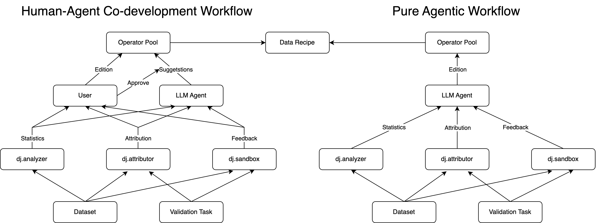

## 🔧 InteRecipe: Interactive Recipe Generation Workflow

### Overview

This demo showcases an interactive and progressive workflow for generating data processing recipes using a Data-Juicer 
Operator Pool. The system enables users and agents to collaboratively build, edit, and validate recipes in a flexible 
and transparent manner.



### Usage

Before running, set below environment variables:

```bash
export DASHSCOPE_API_KEY=your_dashscope_key
```

Install dependencies:
```bash
pip install -r requirements.txt
```

Start the copilot server (replace the `PATH_TO_DJ_REPO` variable in `setup_server.sh` with the absolute path to your data-juicer repository):

```bash
cd dj-copilot
as_scripts/setup_server.sh
```

Note: It is strongly recommended to create a clean data-juicer repository to avoid potential issues. When you change the repository path, make sure to update the `input_dir` field in each knowledge base entry in `dj-copilot/configs/as_config/as_knowledge_configs/knowledge_config.json` accordingly.

Launch the demo with streamlit:
```bash
streamlit run app.py
```

#### Operator Pool Usage

Check `./playground.ipynb`.


### ✨ Core Feature: Operator Pool

The Operator Pool is a specialized, ordered dictionary-like object that stores all candidate Data-Juicer operators (ops)
for data processing.

Each operator in the pool includes:
- Basic information: name and description
- Status: whether the operator is enabled
- Arguments: name, description, type, and current value
- Statistics (based on a dataset snapshot): min, max, mean, std, quantiles
- Ordering: the position of the operator in the current workflow

📊 Visualization & Interaction
- The full state of the operator pool is visualized to provide users with a clear and editable overview.
- The LLM agent leverages this state to suggest modifications or improvements to the data recipe.


🛠️ Supported Actions

Both the user and the LLM agent can take the following actions:
- Enable or disable an operator
- Modify argument values of an operator
- Change the execution order of operators

Each unique configuration of the operator pool corresponds to a distinct data processing recipe.


❓ Why Use an Operator Pool?

**Progressive & Interactive Recipe Generation**

Recipe construction is typically multi-stage—e.g., modality alignment, goal specification, data analysis, attribution, 
etc. The operator pool enables fine-grained control and editing at each stage, supporting incremental and iterative 
development.

**Robustness & Validity**

Directly asking an LLM to generate a full data recipe in one step often results in invalid outputs.
With the operator pool, each modification is validated through strict checks, ensuring recipe integrity and providing 
feedback when issues arise.


### Modules

- LLM Assistant Module: This module can be used to consult LLM Assistant with current operator pool status and 
auxiliary information. The user can apply the suggestions generated by LLM by a single click.
- Data Analysis Module: This module leverages the `dj.analyzer` toolkit to perform comprehensive data analysis. The 
statistics are properly visualized to assist the user in editing the operator pool.
- [WIP] Data Attribution Module: This module aims to measure the contribution of each operator to validation tasks. The 
corresponding toolkit is under development as `dj.attributor`.
- [WIP] Sandbox Module: This module leverages the `dj.sandbox` toolkit to enable feed-back driven operator selection and
edition, by performing small scale experiments.

### Roadmaps

- LLM Assistant Module:
- [x] Basic prompts, dialog box.
- [x] Format suggestion response, parse, apply.
- [ ] Advanced queries, with statistics, attribution, sandbox feedback.


- Data Analysis Module
- [x] Basic visualization
- [x] Quantile plot in operator pool.
- [x] Word cloud.
- [ ] Sequential operator-wise insight visualization


- Data Attribution Module
- [x] Basic attributor: `text_embed_similarity` and `pearson_correlation` based attributor.
- [ ] Advanced attributors: gradient similarity, in-context perplexity, LLM attribution, etc.


- Sandbox Module
- [ ] Basic sandbox deployment.
- [ ] Monitor.


- Others
- [ ] Recipe Gallery


- Pure agentic workflow evaluation
- [ ] benchmarks


- Best practices
- [ ] 