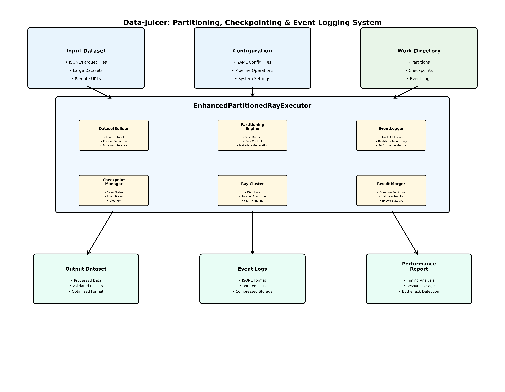
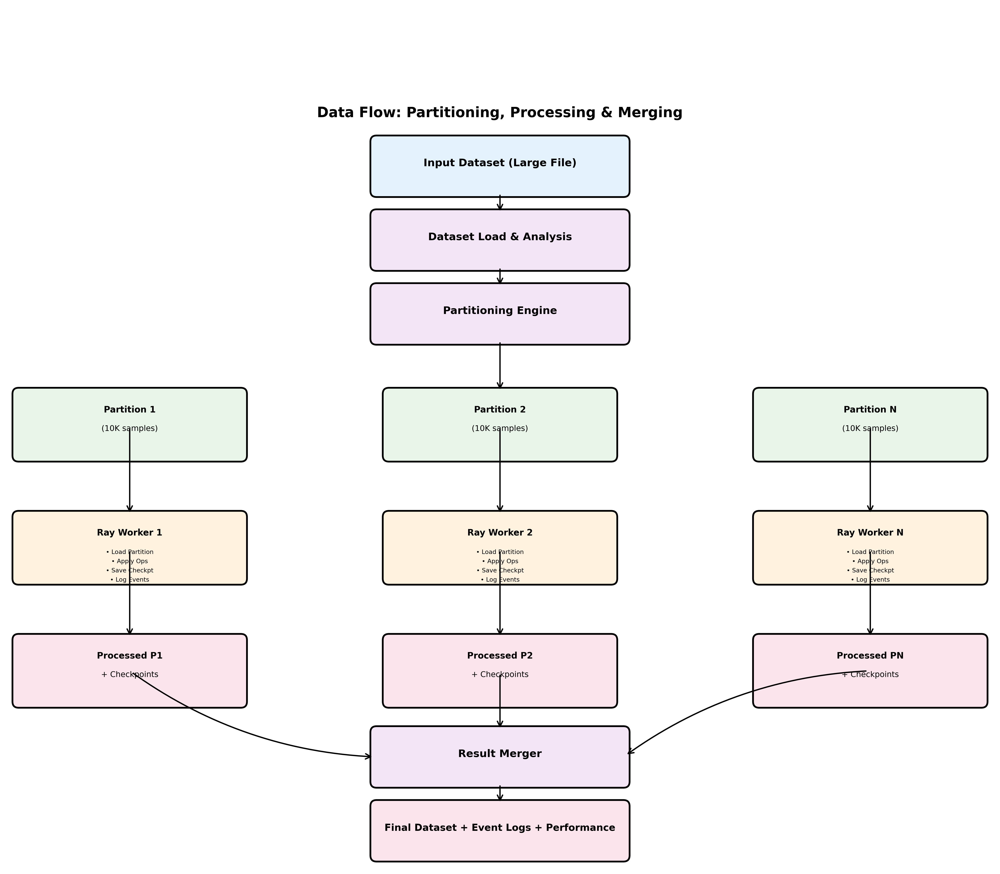
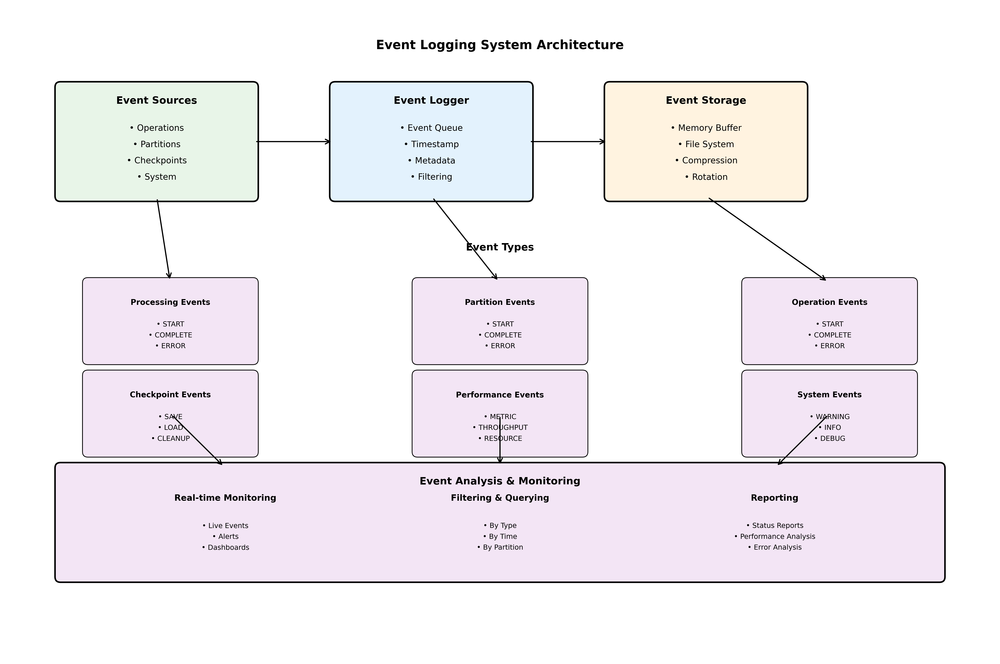
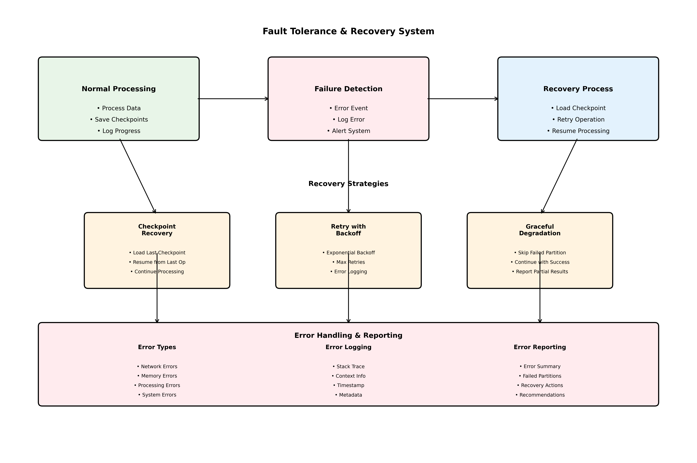

# Data-Juicer: Partitioning, Checkpointing & Event Logging Architecture

## Table of Contents

1. [System Overview](#system-overview)
2. [Architecture Diagrams](#architecture-diagrams)
3. [Component Details](#component-details)
4. [Data Flow](#data-flow)
5. [Event Logging System](#event-logging-system)
6. [Fault Tolerance & Recovery](#fault-tolerance--recovery)
7. [Performance Optimization](#performance-optimization)
8. [Configuration Guide](#configuration-guide)
9. [Usage Examples](#usage-examples)
10. [Best Practices](#best-practices)

## System Overview

The Data-Juicer partitioning, checkpointing, and event logging system provides a comprehensive solution for processing large datasets with fault tolerance, scalability, and complete observability.

### Key Benefits

- **🔧 Fault Tolerance**: Automatic recovery from failures using checkpoints
- **📈 Scalability**: Partition-based processing for datasets of any size
- **👁️ Observability**: Comprehensive event logging and real-time monitoring
- **⚡ Performance**: Optimized storage formats and parallel processing
- **🔄 Flexibility**: Configurable partitioning and checkpointing strategies

## Architecture Diagrams

The following diagrams provide visual representations of the partitioning, checkpointing, and event logging system architecture. High-resolution PNG and vector PDF versions are available in the `docs/imgs/architecture/` directory.

### 1. High-Level System Architecture

```
┌─────────────────────────────────────────────────────────────────────────────────┐
│                           Data-Juicer Processing System                         │
├─────────────────────────────────────────────────────────────────────────────────┤
│                                                                                 │
│  ┌─────────────────┐    ┌─────────────────┐    ┌─────────────────────────────┐ │
│  │   Input Dataset │    │  Configuration  │    │      Work Directory         │ │
│  │                 │    │                 │    │                             │ │
│  │ • JSONL/Parquet │    │ • YAML Config   │    │ • Partitions               │ │
│  │ • Large Files   │    │ • Pipeline Ops  │    │ • Checkpoints              │ │
│  │ • Remote URLs   │    │ • Settings      │    │ • Event Logs               │ │
│  └─────────────────┘    └─────────────────┘    │ • Temp Files               │ │
│                                                 └─────────────────────────────┘ │
│  ┌─────────────────────────────────────────────────────────────────────────────┐ │
│  │                    EnhancedPartitionedRayExecutor                          │ │
│  │                                                                             │ │
│  │  ┌─────────────────┐  ┌─────────────────┐  ┌─────────────────────────────┐ │ │
│  │  │  DatasetBuilder │  │  Partitioning   │  │      EventLogger            │ │
│  │  │                 │  │     Engine      │  │                             │ │
│  │  │ • Load Dataset  │  │ • Split Dataset │  │ • Track All Events          │ │
│  │  │ • Format Detect │  │ • Size Control  │  │ • Real-time Monitoring      │ │
│  │  │ • Schema Infer  │  │ • Metadata Gen  │  │ • Performance Metrics       │ │
│  │  └─────────────────┘  └─────────────────┘  └─────────────────────────────┘ │ │
│  │                                                                             │ │
│  │  ┌─────────────────┐  ┌─────────────────┐  ┌─────────────────────────────┐ │ │
│  │  │CheckpointManager│  │  Ray Cluster    │  │      Result Merger          │ │
│  │  │                 │  │                 │  │                             │ │
│  │  │ • Save States   │  │ • Distribute    │  │ • Combine Partitions        │ │
│  │  │ • Load States   │  │ • Parallel Exec │  │ • Validate Results          │ │
│  │  │ • Cleanup       │  │ • Fault Handle  │  │ • Export Final Dataset      │ │
│  │  └─────────────────┘  └─────────────────┘  └─────────────────────────────┘ │ │
│  └─────────────────────────────────────────────────────────────────────────────┘ │
│                                                                                 │
│  ┌─────────────────┐    ┌─────────────────┐    ┌─────────────────────────────┐ │
│  │  Output Dataset │    │   Event Logs    │    │      Performance Report     │ │
│  │                 │    │                 │    │                             │ │
│  │ • Processed     │    │ • JSONL Format  │    │ • Timing Analysis           │ │
│  │ • Validated     │    │ • Rotated Logs  │    │ • Resource Usage            │ │
│  │ • Optimized     │    │ • Compressed    │    │ • Bottleneck Detection      │ │
│  └─────────────────┘    └─────────────────┘    └─────────────────────────────┘ │
└─────────────────────────────────────────────────────────────────────────────────┘
```



*Figure 1: High-level system architecture showing the main components and data flow*

The system architecture consists of three main input sources (Input Dataset, Configuration, Work Directory), the core EnhancedPartitionedRayExecutor with its six key components, and three output destinations (Output Dataset, Event Logs, Performance Report).

**Key Components:**
- **Input Sources**: Dataset files, configuration files, and work directory for intermediate data
- **Core Executor**: EnhancedPartitionedRayExecutor with DatasetBuilder, Partitioning Engine, EventLogger, CheckpointManager, Ray Cluster, and Result Merger
- **Output Destinations**: Processed dataset, comprehensive event logs, and detailed performance reports

### 2. Detailed Component Architecture

```
┌─────────────────────────────────────────────────────────────────────────────────┐
│                           EnhancedPartitionedRayExecutor                       │
├─────────────────────────────────────────────────────────────────────────────────┤
│                                                                                 │
│  ┌─────────────────────────────────────────────────────────────────────────────┐ │
│  │                              Initialization                                │ │
│  │                                                                             │ │
│  │  ┌─────────────────┐  ┌─────────────────┐  ┌─────────────────────────────┐ │ │
│  │  │  Config Parser  │  │  Work Dir Setup │  │      Event Logger Init      │ │
│  │  │                 │  │                 │  │                             │ │
│  │  │ • Load YAML     │  │ • Create Dirs   │  │ • Setup Log Files           │ │
│  │  │ • Validate      │  │ • Check Perms   │  │ • Configure Rotation        │ │
│  │  │ • Set Defaults  │  │ • Clean Old     │  │ • Start Monitoring          │ │
│  │  └─────────────────┘  └─────────────────┘  └─────────────────────────────┘ │ │
│  └─────────────────────────────────────────────────────────────────────────────┘ │
│                                                                                 │
│  ┌─────────────────────────────────────────────────────────────────────────────┐ │
│  │                              Dataset Loading                               │ │
│  │                                                                             │ │
│  │  ┌─────────────────┐  ┌─────────────────┐  ┌─────────────────────────────┐ │ │
│  │  │  DatasetBuilder │  │  Format Detector│  │      Schema Analyzer        │ │
│  │  │                 │  │                 │  │                             │ │
│  │  │ • Load Dataset  │  │ • Detect Format │  │ • Infer Schema              │ │
│  │  │ • Handle Errors │  │ • Validate File │  │ • Check Compatibility       │ │
│  │  │ • Log Progress  │  │ • Log Metadata  │  │ • Report Issues             │ │
│  │  └─────────────────┘  └─────────────────┘  └─────────────────────────────┘ │ │
│  └─────────────────────────────────────────────────────────────────────────────┘ │
│                                                                                 │
│  ┌─────────────────────────────────────────────────────────────────────────────┐ │
│  │                              Partitioning                                  │ │
│  │                                                                             │ │
│  │  ┌─────────────────┐  ┌─────────────────┐  ┌─────────────────────────────┐ │ │
│  │  │  Size Calculator│  │  Partition Split│  │      Metadata Generator     │ │
│  │  │                 │  │                 │  │                             │ │
│  │  │ • Calc Optimal  │  │ • Split Dataset │  │ • Generate Metadata         │ │
│  │  │ • Check Limits  │  │ • Save Partitions│ │ • Track Boundaries          │ │
│  │  │ • Log Decisions │  │ • Handle Errors │  │ • Create Mapping            │ │
│  │  └─────────────────┘  └─────────────────┘  └─────────────────────────────┘ │ │
│  └─────────────────────────────────────────────────────────────────────────────┘ │
│                                                                                 │
│  ┌─────────────────────────────────────────────────────────────────────────────┐ │
│  │                              Processing                                    │ │
│  │                                                                             │ │
│  │  ┌─────────────────┐  ┌─────────────────┐  ┌─────────────────────────────┐ │ │
│  │  │  Ray Cluster    │  │  Partition Exec │  │      Checkpoint Manager     │ │
│  │  │                 │  │                 │  │                             │ │
│  │  │ • Distribute    │  │ • Process Ops   │  │ • Save Checkpoints          │ │
│  │  │ • Monitor       │  │ • Handle Errors │  │ • Load Checkpoints          │ │
│  │  │ • Scale         │  │ • Log Progress  │  │ • Cleanup Old               │ │
│  │  └─────────────────┘  └─────────────────┘  └─────────────────────────────┘ │ │
│  └─────────────────────────────────────────────────────────────────────────────┘ │
│                                                                                 │
│  ┌─────────────────────────────────────────────────────────────────────────────┐ │
│  │                              Result Merging                                │ │
│  │                                                                             │ │
│  │  ┌─────────────────┐  ┌─────────────────┐  ┌─────────────────────────────┐ │ │
│  │  │  Result Collector│ │  Data Validator │  │      Final Exporter         │ │
│  │  │                 │  │                 │  │                             │ │
│  │  │ • Collect Parts │  │ • Validate Data │  │ • Export Dataset            │ │
│  │  │ • Handle Errors │  │ • Check Schema  │  │ • Generate Report           │ │
│  │  │ • Log Status    │  │ • Report Issues │  │ • Cleanup Temp              │ │
│  │  └─────────────────┘  └─────────────────┘  └─────────────────────────────┘ │ │
│  └─────────────────────────────────────────────────────────────────────────────┘ │
└─────────────────────────────────────────────────────────────────────────────────┘
```


*Figure 2: Detailed component architecture showing internal structure and relationships*

The detailed component architecture shows the five main phases of execution: Initialization, Dataset Loading, Partitioning, Processing, and Result Merging. Each phase contains specialized components that work together to process data efficiently.

### 3. Data Flow Diagram

```
┌─────────────────┐
│  Input Dataset  │
│   (Large File)  │
└─────────┬───────┘
          │
          ▼
┌─────────────────┐
│  Dataset Load   │
│   & Analysis    │
└─────────┬───────┘
          │
          ▼
┌─────────────────┐
│   Partitioning  │
│   Engine        │
└─────────┬───────┘
          │
          ▼
┌─────────────────┐    ┌─────────────────┐    ┌─────────────────┐
│  Partition 1    │    │  Partition 2    │    │  Partition N    │
│  (10K samples)  │    │  (10K samples)  │    │  (10K samples)  │
└─────────┬───────┘    └─────────┬───────┘    └─────────┬───────┘
          │                      │                      │
          ▼                      ▼                      ▼
┌─────────────────┐    ┌─────────────────┐    ┌─────────────────┐
│  Ray Worker 1   │    │  Ray Worker 2   │    │  Ray Worker N   │
│                 │    │                 │    │                 │
│ • Load Partition│    │ • Load Partition│    │ • Load Partition│
│ • Apply Ops     │    │ • Apply Ops     │    │ • Apply Ops     │
│ • Save Checkpt  │    │ • Save Checkpt  │    │ • Save Checkpt  │
│ • Log Events    │    │ • Log Events    │    │ • Log Events    │
└─────────┬───────┘    └─────────┬───────┘    └─────────┬───────┘
          │                      │                      │
          ▼                      ▼                      ▼
┌─────────────────┐    ┌─────────────────┐    ┌─────────────────┐
│  Processed P1   │    │  Processed P2   │    │  Processed PN   │
│  + Checkpoints  │    │  + Checkpoints  │    │  + Checkpoints  │
└─────────┬───────┘    └─────────┬───────┘    └─────────┬───────┘
          │                      │                      │
          └──────────────────────┼──────────────────────┘
                                 │
                                 ▼
                    ┌─────────────────┐
                    │  Result Merger  │
                    │                 │
                    │ • Load Results  │
                    │ • Validate Data │
                    │ • Merge Dataset │
                    │ • Export Final  │
                    └─────────┬───────┘
                              │
                              ▼
                    ┌─────────────────┐
                    │  Final Dataset  │
                    │  + Event Logs   │
                    │  + Performance  │
                    │  + Checkpoints  │
                    └─────────────────┘
```



*Figure 3: Data flow diagram showing the complete processing pipeline*

The data flow diagram illustrates the complete processing pipeline from input dataset to final output. Key stages include dataset loading, partitioning into manageable chunks, parallel processing by Ray workers, and final result merging.

**Processing Stages:**
1. **Input Processing**: Large dataset loaded and analyzed
2. **Partitioning**: Dataset split into smaller partitions (10K samples each)
3. **Parallel Processing**: Each partition processed independently by Ray workers
4. **Checkpointing**: Intermediate results saved after each operation
5. **Result Merging**: All processed partitions combined into final dataset

### 4. Event Logging Flow

```
┌─────────────────────────────────────────────────────────────────────────────────┐
│                              Event Logging System                               │
├─────────────────────────────────────────────────────────────────────────────────┤
│                                                                                 │
│  ┌─────────────────┐    ┌─────────────────┐    ┌─────────────────────────────┐ │
│  │  Event Sources  │    │  Event Logger   │    │      Event Storage          │ │
│  │                 │    │                 │    │                             │ │
│  │ • Operations    │───▶│ • Event Queue   │───▶│ • Memory Buffer             │ │
│  │ • Partitions    │    │ • Timestamp     │    │ • File System               │ │
│  │ • Checkpoints   │    │ • Metadata      │    │ • Compression               │ │
│  │ • System        │    │ • Filtering     │    │ • Rotation                  │ │
│  └─────────────────┘    └─────────────────┘    └─────────────────────────────┘ │
│                                                                                 │
│  ┌─────────────────────────────────────────────────────────────────────────────┐ │
│  │                              Event Types                                    │ │
│  │                                                                             │ │
│  │  ┌─────────────────┐  ┌─────────────────┐  ┌─────────────────────────────┐ │ │
│  │  │ Processing      │  │ Partition       │  │      Operation              │ │ │
│  │  │ Events          │  │ Events          │  │      Events                 │ │ │
│  │  │                 │  │                 │  │                             │ │ │
│  │  │ • START         │  │ • START         │  │ • START                     │ │ │
│  │  │ • COMPLETE      │  │ • COMPLETE      │  │ • COMPLETE                  │ │ │
│  │  │ • ERROR         │  │ • ERROR         │  │ • ERROR                     │ │ │
│  │  └─────────────────┘  └─────────────────┘  └─────────────────────────────┘ │ │
│  │                                                                             │ │
│  │  ┌─────────────────┐  ┌─────────────────┐  ┌─────────────────────────────┐ │ │
│  │  │ Checkpoint      │  │ Performance     │  │      System                 │ │ │
│  │  │ Events          │  │ Events          │  │      Events                 │ │ │
│  │  │                 │  │                 │  │                             │ │ │
│  │  │ • SAVE          │  │ • METRIC        │  │ • WARNING                   │ │ │
│  │  │ • LOAD          │  │ • THROUGHPUT    │  │ • INFO                      │ │ │
│  │  │ • CLEANUP       │  │ • RESOURCE      │  │ • DEBUG                     │ │ │
│  │  └─────────────────┘  └─────────────────┘  └─────────────────────────────┘ │ │
│  └─────────────────────────────────────────────────────────────────────────────┘ │
│                                                                                 │
│  ┌─────────────────────────────────────────────────────────────────────────────┐ │
│  │                              Event Analysis                                 │ │
│  │                                                                             │ │
│  │  ┌─────────────────┐  ┌─────────────────┐  ┌─────────────────────────────┐ │ │
│  │  │ Real-time       │  │ Filtering &     │  │      Reporting              │ │ │
│  │  │ Monitoring      │  │ Querying        │  │                             │ │ │
│  │  │                 │  │                 │  │                             │ │ │
│  │  │ • Live Events   │  │ • By Type       │  │ • Status Reports            │ │ │
│  │  │ • Alerts        │  │ • By Time       │  │ • Performance Analysis      │ │ │
│  │  │ • Dashboards    │  │ • By Partition  │  │ • Error Analysis            │ │ │
│  │  └─────────────────┘  └─────────────────┘  └─────────────────────────────┘ │ │
│  └─────────────────────────────────────────────────────────────────────────────┘ │
└─────────────────────────────────────────────────────────────────────────────────┘
```



*Figure 4: Event logging system architecture and flow*

The event logging system captures all processing events, performance metrics, and system states. Events flow from sources through the logger to storage, with comprehensive analysis and monitoring capabilities.

**Event Flow:**
1. **Event Sources**: Operations, partitions, checkpoints, and system events
2. **Event Logger**: Queues, timestamps, and filters events
3. **Event Storage**: Memory buffer, file system, compression, and rotation
4. **Event Analysis**: Real-time monitoring, filtering, and reporting

### 5. Fault Tolerance & Recovery Flow

```
┌─────────────────────────────────────────────────────────────────────────────────┐
│                           Fault Tolerance & Recovery                           │
├─────────────────────────────────────────────────────────────────────────────────┤
│                                                                                 │
│  ┌─────────────────┐    ┌─────────────────┐    ┌─────────────────────────────┐ │
│  │  Normal         │    │  Failure        │    │      Recovery               │ │
│  │  Processing     │    │  Detection      │    │      Process                │ │
│  │                 │    │                 │    │                             │ │
│  │ • Process       │───▶│ • Error Event   │───▶│ • Load Checkpoint           │ │
│  │ • Save Checkpt  │    │ • Log Error     │    │ • Retry Operation           │ │
│  │ • Log Progress  │    │ • Alert System  │    │ • Resume Processing         │ │
│  └─────────────────┘    └─────────────────┘    └─────────────────────────────┘ │
│                                                                                 │
│  ┌─────────────────────────────────────────────────────────────────────────────┐ │
│  │                              Recovery Strategies                           │ │
│  │                                                                             │ │
│  │  ┌─────────────────┐  ┌─────────────────┐  ┌─────────────────────────────┐ │ │
│  │  │ Checkpoint      │  │ Retry with      │  │      Graceful               │ │ │
│  │  │ Recovery        │  │ Backoff         │  │      Degradation            │ │ │
│  │  │                 │  │                 │  │                             │ │ │
│  │  │ • Load Last     │  │ • Exponential   │  │ • Skip Failed               │ │ │
│  │  │   Checkpoint    │  │   Backoff       │  │   Partition                 │ │ │
│  │  │ • Resume from   │  │ • Max Retries   │  │ • Continue with             │ │ │
│  │  │   Last Op       │  │ • Error Logging │  │   Success                    │ │ │
│  │  └─────────────────┘  └─────────────────┘  └─────────────────────────────┘ │ │
│  └─────────────────────────────────────────────────────────────────────────────┘ │
│                                                                                 │
│  ┌─────────────────────────────────────────────────────────────────────────────┐ │
│  │                              Error Handling                                │ │
│  │                                                                             │ │
│  │  ┌─────────────────┐  ┌─────────────────┐  ┌─────────────────────────────┐ │ │
│  │  │ Error Types     │  │ Error Logging   │  │      Error Reporting        │ │ │
│  │  │                 │  │                 │  │                             │ │ │
│  │  │ • Network       │  │ • Stack Trace   │  │ • Error Summary              │ │ │
│  │  │ • Memory        │  │ • Context       │  │ • Failed Partitions         │ │ │
│  │  │ • Processing    │  │ • Timestamp     │  │ • Recovery Actions          │ │ │
│  │  │ • System        │  │ • Metadata      │  │ • Recommendations           │ │ │
│  │  └─────────────────┘  └─────────────────┘  └─────────────────────────────┘ │ │
│  └─────────────────────────────────────────────────────────────────────────────┘ │
└─────────────────────────────────────────────────────────────────────────────────┘
```



*Figure 5: Fault tolerance and recovery system architecture*

The fault tolerance system provides multiple recovery strategies to handle failures gracefully. The system can recover from checkpoints, retry with exponential backoff, or gracefully degrade by skipping failed partitions.

**Recovery Strategies:**
1. **Checkpoint Recovery**: Load last successful checkpoint and resume
2. **Retry with Backoff**: Exponential backoff with maximum retry limits
3. **Graceful Degradation**: Skip failed partitions and continue processing
4. **Error Handling**: Comprehensive error logging and reporting

## Component Details

### 1. EnhancedPartitionedRayExecutor

The main executor that orchestrates the entire partitioning, checkpointing, and event logging system.

**Key Responsibilities:**
- Dataset loading and analysis
- Partition creation and management
- Ray cluster coordination
- Checkpoint management
- Event logging coordination
- Result collection and merging

**Core Methods:**
```python
class EnhancedPartitionedRayExecutor:
    def __init__(self, cfg):
        # Initialize all components
        self.event_logger = EventLogger()
        self.checkpoint_manager = CheckpointManager()
        self.partition_manager = PartitionManager()
    
    def run(self):
        # Main execution flow
        self._load_dataset()
        self._create_partitions()
        self._process_partitions()
        self._merge_results()
```

### 2. EventLogger

Comprehensive event tracking system that logs all operations, performance metrics, and system events.

**Event Types:**
- **Processing Events**: Start, complete, error
- **Partition Events**: Start, complete, error, checkpoint
- **Operation Events**: Start, complete, error, performance
- **System Events**: Warning, info, debug
- **Performance Events**: Metrics, throughput, resource usage

**Key Features:**
- Real-time event streaming
- Event filtering and querying
- Performance analysis
- Status reporting
- Log rotation and compression

### 3. CheckpointManager

Manages checkpoint creation, loading, and cleanup for fault tolerance.

**Checkpoint Types:**
- **Operation Checkpoints**: After each operation
- **Partition Checkpoints**: After partition completion
- **System Checkpoints**: At critical points

**Storage Formats:**
- **Parquet**: High compression, fast I/O
- **Arrow**: Memory-efficient, zero-copy
- **JSONL**: Human-readable, compatible

### 4. PartitionManager

Handles dataset partitioning and partition metadata management.

**Partitioning Strategies:**
- **Size-based**: Control partition file size
- **Sample-based**: Control samples per partition
- **Adaptive**: Automatic size calculation

## Data Flow

### 1. Dataset Loading Phase

```
Input Dataset → Format Detection → Schema Analysis → Size Calculation → Partitioning Decision
```

### 2. Partitioning Phase

```
Large Dataset → Partition Split → Metadata Generation → Storage → Ray Distribution
```

### 3. Processing Phase

```
Partition → Ray Worker → Operation Application → Checkpoint Save → Event Logging → Next Operation
```

### 4. Recovery Phase

```
Failure Detection → Checkpoint Load → Retry Operation → Success/Failure → Continue/Skip
```

### 5. Merging Phase

```
Processed Partitions → Result Collection → Data Validation → Final Export → Cleanup
```

## Event Logging System

### Event Structure

```python
@dataclass
class Event:
    event_type: EventType
    timestamp: float
    message: str
    partition_id: Optional[int] = None
    operation_name: Optional[str] = None
    duration: Optional[float] = None
    error_message: Optional[str] = None
    stack_trace: Optional[str] = None
    metadata: Optional[Dict[str, Any]] = None
    resource_usage: Optional[Dict[str, Any]] = None
    performance_metrics: Optional[Dict[str, Any]] = None
```

### Event Categories

1. **Processing Events**
   - `PROCESSING_START`: Pipeline execution started
   - `PROCESSING_COMPLETE`: Pipeline execution completed
   - `PROCESSING_ERROR`: Pipeline execution failed

2. **Partition Events**
   - `PARTITION_START`: Partition processing started
   - `PARTITION_COMPLETE`: Partition processing completed
   - `PARTITION_ERROR`: Partition processing failed

3. **Operation Events**
   - `OPERATION_START`: Operation execution started
   - `OPERATION_COMPLETE`: Operation execution completed
   - `OPERATION_ERROR`: Operation execution failed

4. **Checkpoint Events**
   - `CHECKPOINT_SAVE`: Checkpoint saved
   - `CHECKPOINT_LOAD`: Checkpoint loaded
   - `CHECKPOINT_CLEANUP`: Checkpoint cleaned up

5. **Performance Events**
   - `PERFORMANCE_METRIC`: Performance measurement
   - `RESOURCE_USAGE`: Resource utilization

### Event Analysis

```python
# Get all events
all_events = executor.get_events()

# Filter by type
operation_events = executor.get_events(event_type=EventType.OPERATION_START)

# Filter by time range
recent_events = executor.get_events(start_time=time.time() - 3600)

# Get performance summary
perf_summary = executor.get_performance_summary()

# Generate status report
report = executor.generate_status_report()
```

## Fault Tolerance & Recovery

### Recovery Strategies

1. **Checkpoint Recovery**
   - Load last successful checkpoint
   - Resume from last operation
   - Continue processing

2. **Retry with Backoff**
   - Exponential backoff strategy
   - Maximum retry attempts
   - Error logging and analysis

3. **Graceful Degradation**
   - Skip failed partitions
   - Continue with successful partitions
   - Report partial results

### Error Handling

```python
try:
    # Process partition
    result = self._process_partition(partition)
    self._save_checkpoint(partition, result)
    self._log_event(EventType.PARTITION_COMPLETE, partition_id=partition.id)
except Exception as e:
    # Log error
    self._log_event(EventType.PARTITION_ERROR, partition_id=partition.id, error_message=str(e))
    
    # Attempt recovery
    if self._can_recover_from_checkpoint(partition):
        self._recover_from_checkpoint(partition)
    else:
        self._skip_partition(partition)
```

## Performance Optimization

### Storage Format Optimization

1. **Parquet Format**
   - 3-5x compression ratio
   - 2-3x faster I/O
   - Columnar storage benefits

2. **Arrow Format**
   - Memory-efficient processing
   - Zero-copy reads
   - Batch processing optimization

3. **JSONL Format**
   - Human-readable
   - Universal compatibility
   - Easy debugging

### Parallel Processing

1. **Ray Cluster**
   - Distributed processing
   - Automatic scaling
   - Fault tolerance

2. **Partition Parallelism**
   - Independent partition processing
   - Load balancing
   - Resource optimization

## Configuration Guide

### Basic Configuration

```yaml
# Basic settings
project_name: 'my-partitioned-project'
dataset_path: 'data/large-dataset.jsonl'
export_path: 'outputs/processed-dataset.jsonl'
executor_type: 'ray_partitioned'

# Ray configuration
ray_address: 'auto'

# Partitioning configuration
partition_size: 10000
max_partition_size_mb: 128
enable_fault_tolerance: true
max_retries: 3

# Storage configuration
storage_format: 'parquet'
preserve_intermediate_data: true

# Event logging
event_logging:
  enabled: true
  log_level: 'INFO'
  max_log_size_mb: 100
  backup_count: 5

# Processing pipeline
process:
  - whitespace_normalization_mapper:
  - text_length_filter:
      min_len: 50
      max_len: 2000
  - language_id_score_filter:
      lang: 'en'
      min_score: 0.8
```

### Advanced Configuration

```yaml
# Checkpointing
checkpointing:
  enabled: true
  storage_format: 'parquet'
  compression: 'snappy'
  max_checkpoints_per_partition: 10
  cleanup_old_checkpoints: true

# Performance optimization
performance:
  use_arrow_batches: true
  arrow_batch_size: 1000
  memory_mapping: false

# Recovery settings
recovery:
  enabled: true
  max_retries: 3
  retry_delay_seconds: 5
  use_checkpoints_for_recovery: true
  restart_from_beginning_if_no_checkpoint: true
```

## Usage Examples

### 1. Basic Usage

```python
from data_juicer.config import init_configs
from data_juicer.core.executor.ray_executor_partitioned import PartitionedRayExecutor

# Load configuration
cfg = init_configs()

# Create executor
executor = PartitionedRayExecutor(cfg)

# Run processing
result = executor.run()

# Get events
events = executor.get_events()
print(f"Logged {len(events)} events")

# Get performance summary
perf_summary = executor.get_performance_summary()
print(f"Performance: {perf_summary}")
```

### 2. Real-time Monitoring

```python
# Monitor events in real-time
for event in executor.monitor_events():
    print(f"[{event.timestamp:.3f}] {event.event_type.value}: {event.message}")
    
    if event.event_type == EventType.OPERATION_ERROR:
        print(f"Error: {event.error_message}")
```

### 3. Event Analysis

```python
# Get partition-specific events
partition_events = executor.get_events(event_type=EventType.PARTITION_COMPLETE)
print(f"Completed partitions: {len(partition_events)}")

# Get performance for specific operation
filter_perf = executor.get_performance_summary(operation_name="text_length_filter")
print(f"Filter performance: {filter_perf}")

# Generate comprehensive report
report = executor.generate_status_report()
print(report)
```

## Best Practices

### 1. Configuration

- **Enable Event Logging**: Always enable for production
- **Set Appropriate Log Levels**: INFO for production, DEBUG for development
- **Configure Log Rotation**: Prevent disk space issues
- **Set Partition Sizes**: Balance memory usage and parallelism

### 2. Monitoring

- **Real-time Monitoring**: Use for immediate feedback
- **Performance Tracking**: Monitor regularly
- **Error Analysis**: Analyze patterns and trends
- **Resource Monitoring**: Track usage patterns

### 3. Fault Tolerance

- **Enable Checkpointing**: For critical operations
- **Set Retry Limits**: Prevent infinite loops
- **Monitor Recovery**: Track recovery success rates
- **Test Failure Scenarios**: Validate recovery mechanisms

### 4. Performance

- **Use Parquet Format**: For best compression and speed
- **Optimize Partition Size**: Balance memory and parallelism
- **Monitor Resource Usage**: Prevent bottlenecks
- **Profile Operations**: Identify slow operations

### 5. Maintenance

- **Regular Cleanup**: Remove old checkpoints and logs
- **Monitor Disk Space**: Prevent storage issues
- **Update Configurations**: Based on usage patterns
- **Backup Important Data**: Before major changes

## Conclusion

The Data-Juicer partitioning, checkpointing, and event logging system provides a comprehensive solution for processing large datasets with:

- **🔧 Fault Tolerance**: Automatic recovery from failures
- **📈 Scalability**: Partition-based processing
- **👁️ Observability**: Comprehensive event logging
- **⚡ Performance**: Optimized storage and processing
- **🔄 Flexibility**: Configurable strategies

This architecture ensures reliable, scalable, and observable data processing for datasets of any size, making Data-Juicer suitable for both development and production environments. 