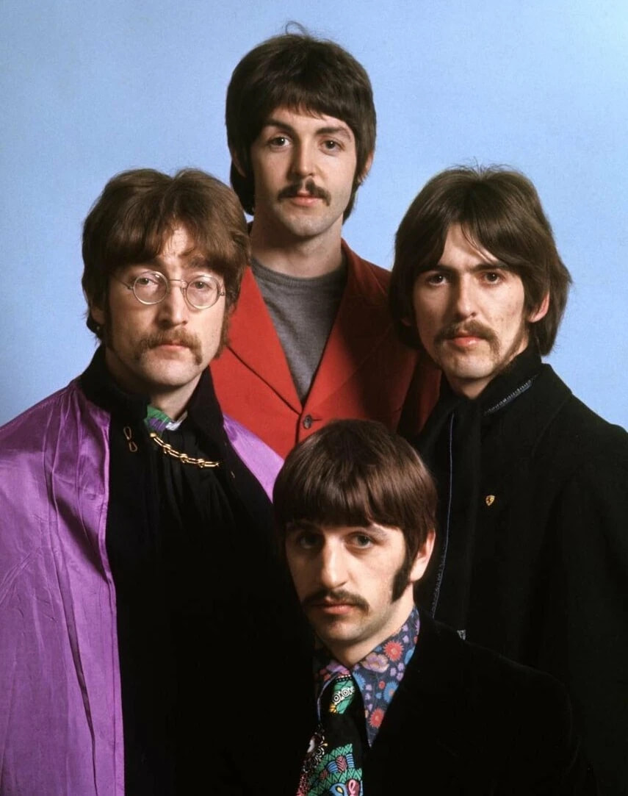

# image_face_count_filter

Filter to keep samples with the number of faces within a specific range.

This operator uses an OpenCV classifier for face detection. It filters samples based on the number of faces detected in the images, keeping only those with a face count within the specified range. The operator supports two strategies: 'any' (keep if any image meets the condition) and 'all' (keep only if all images meet the condition). The face counts are cached in the 'face_counts' field. If no images are present in the sample, the face count is set to an empty array.

过滤出人脸数量在特定范围内的样本。

该算子使用 OpenCV 分类器进行面部检测。它根据图像中检测到的人脸数量来过滤样本，仅保留人脸数量在指定范围内的样本。该算子支持两种策略：'any'（只要有任何一张图片符合条件就保留）和 'all'（只有当所有图片都符合条件时才保留）。人脸数量会被缓存在 'face_counts' 字段中。如果样本中没有图片，则人脸数量会被设置为空数组。

Type 算子类型: **filter**

Tags 标签: cpu, image

## 🔧 Parameter Configuration 参数配置
| name 参数名 | type 类型 | default 默认值 | desc 说明 |
|--------|------|--------|------|
| `cv_classifier` | <class 'str'> | `''` | OpenCV classifier path for face detection. By default, we will use 'haarcascade_frontalface_alt.xml'. |
| `min_face_count` | <class 'int'> | `1` | Minimum number of faces required for samples. |
| `max_face_count` | <class 'int'> | `1` | Maximum number of faces required for samples. |
| `any_or_all` | <class 'str'> | `'any'` | Keep this sample with 'any' or 'all' strategy of all images. 'any': keep this sample if any images meet the condition. 'all': keep this sample only if all images meet the condition. |
| `args` |  | `''` | Extra positional arguments. |
| `kwargs` |  | `''` | Extra keyword arguments. |

## 📊 Effect demonstration 效果演示
### test_filter_1
```python
ImageFaceCountFilter(min_face_count=1, max_face_count=1)
```

#### 📥 input data 输入数据
<div class="sample-card" style="border:1px solid #ddd; padding:12px; margin:8px 0; border-radius:6px; background:#fafafa; box-shadow:0 1px 3px rgba(0,0,0,0.1);"><div class="sample-header" style="background:#f8f9fa; padding:4px 8px; margin-bottom:6px; border-radius:3px; font-size:0.9em; color:#666; border-left:3px solid #007acc;"><strong>Sample 1:</strong> 1 image</div><div class="media-section" style="margin-bottom:8px;"><div class="media-label" style="font-size:0.85em; color:#666; margin-bottom:4px; font-weight:500;">cat.jpg:</div><div class="image-grid"></div></div></div><div class="sample-card" style="border:1px solid #ddd; padding:12px; margin:8px 0; border-radius:6px; background:#fafafa; box-shadow:0 1px 3px rgba(0,0,0,0.1);"><div class="sample-header" style="background:#f8f9fa; padding:4px 8px; margin-bottom:6px; border-radius:3px; font-size:0.9em; color:#666; border-left:3px solid #007acc;"><strong>Sample 2:</strong> 1 image</div><div class="media-section" style="margin-bottom:8px;"><div class="media-label" style="font-size:0.85em; color:#666; margin-bottom:4px; font-weight:500;">lena.jpg:</div><div class="image-grid"></div></div></div><div class="sample-card" style="border:1px solid #ddd; padding:12px; margin:8px 0; border-radius:6px; background:#fafafa; box-shadow:0 1px 3px rgba(0,0,0,0.1);"><div class="sample-header" style="background:#f8f9fa; padding:4px 8px; margin-bottom:6px; border-radius:3px; font-size:0.9em; color:#666; border-left:3px solid #007acc;"><strong>Sample 3:</strong> 1 image</div><div class="media-section" style="margin-bottom:8px;"><div class="media-label" style="font-size:0.85em; color:#666; margin-bottom:4px; font-weight:500;">img8.jpg:</div><div class="image-grid"></div></div></div>

#### 📤 output data 输出数据
<div class="sample-card" style="border:1px solid #ddd; padding:12px; margin:8px 0; border-radius:6px; background:#fafafa; box-shadow:0 1px 3px rgba(0,0,0,0.1);"><div class="sample-header" style="background:#f8f9fa; padding:4px 8px; margin-bottom:6px; border-radius:3px; font-size:0.9em; color:#666; border-left:3px solid #007acc;"><strong>Sample 1:</strong> 1 image</div><div class="media-section" style="margin-bottom:8px;"><div class="media-label" style="font-size:0.85em; color:#666; margin-bottom:4px; font-weight:500;">lena.jpg:</div><div class="image-grid"></div></div></div>

#### ✨ explanation 解释
The operator filters out samples with a face count not within the range of 1 to 1. Only the sample with 'lena.jpg' is kept because it has exactly one face, while others are removed for not meeting the condition.
算子过滤掉脸部数量不在1到1范围内的样本。只有包含'lena.jpg'的样本被保留，因为它恰好有一张脸，而其他不满足条件的样本则被移除。

### test_any
```python
ImageFaceCountFilter(min_face_count=1, max_face_count=1, any_or_all='any')
```

#### 📥 input data 输入数据
<div class="sample-card" style="border:1px solid #ddd; padding:12px; margin:8px 0; border-radius:6px; background:#fafafa; box-shadow:0 1px 3px rgba(0,0,0,0.1);"><div class="sample-header" style="background:#f8f9fa; padding:4px 8px; margin-bottom:6px; border-radius:3px; font-size:0.9em; color:#666; border-left:3px solid #007acc;"><strong>Sample 1:</strong> 2 images</div><div class="media-section" style="margin-bottom:8px;"><div class="media-label" style="font-size:0.85em; color:#666; margin-bottom:4px; font-weight:500;">cat.jpg|lena.jpg:</div><div class="image-grid"></div></div></div><div class="sample-card" style="border:1px solid #ddd; padding:12px; margin:8px 0; border-radius:6px; background:#fafafa; box-shadow:0 1px 3px rgba(0,0,0,0.1);"><div class="sample-header" style="background:#f8f9fa; padding:4px 8px; margin-bottom:6px; border-radius:3px; font-size:0.9em; color:#666; border-left:3px solid #007acc;"><strong>Sample 2:</strong> 2 images</div><div class="media-section" style="margin-bottom:8px;"><div class="media-label" style="font-size:0.85em; color:#666; margin-bottom:4px; font-weight:500;">lena.jpg|img8.jpg:</div><div class="image-grid"></div></div></div><div class="sample-card" style="border:1px solid #ddd; padding:12px; margin:8px 0; border-radius:6px; background:#fafafa; box-shadow:0 1px 3px rgba(0,0,0,0.1);"><div class="sample-header" style="background:#f8f9fa; padding:4px 8px; margin-bottom:6px; border-radius:3px; font-size:0.9em; color:#666; border-left:3px solid #007acc;"><strong>Sample 3:</strong> 2 images</div><div class="media-section" style="margin-bottom:8px;"><div class="media-label" style="font-size:0.85em; color:#666; margin-bottom:4px; font-weight:500;">cat.jpg|img8.jpg:</div><div class="image-grid"></div></div></div>

#### 📤 output data 输出数据
<div class="sample-card" style="border:1px solid #ddd; padding:12px; margin:8px 0; border-radius:6px; background:#fafafa; box-shadow:0 1px 3px rgba(0,0,0,0.1);"><div class="sample-header" style="background:#f8f9fa; padding:4px 8px; margin-bottom:6px; border-radius:3px; font-size:0.9em; color:#666; border-left:3px solid #007acc;"><strong>Sample 1:</strong> 2 images</div><div class="media-section" style="margin-bottom:8px;"><div class="media-label" style="font-size:0.85em; color:#666; margin-bottom:4px; font-weight:500;">cat.jpg|lena.jpg:</div><div class="image-grid"></div></div></div><div class="sample-card" style="border:1px solid #ddd; padding:12px; margin:8px 0; border-radius:6px; background:#fafafa; box-shadow:0 1px 3px rgba(0,0,0,0.1);"><div class="sample-header" style="background:#f8f9fa; padding:4px 8px; margin-bottom:6px; border-radius:3px; font-size:0.9em; color:#666; border-left:3px solid #007acc;"><strong>Sample 2:</strong> 2 images</div><div class="media-section" style="margin-bottom:8px;"><div class="media-label" style="font-size:0.85em; color:#666; margin-bottom:4px; font-weight:500;">lena.jpg|img8.jpg:</div><div class="image-grid"></div></div></div>

#### ✨ explanation 解释
The operator retains samples if any image in the sample has a face count within the 1 to 1 range. The first and second samples are kept because they each contain at least one image ('lena.jpg') that meets the criteria, whereas the third sample is excluded as neither image meets the requirement.
如果样本中的任何一张图片的脸部数量在1到1范围内，则算子会保留该样本。第一和第二个样本被保留，因为它们各自至少包含一张符合标准的图片（'lena.jpg'），而第三个样本由于没有图片满足要求而被排除。


## 🔗 related links 相关链接
- [source code 源代码](../../../data_juicer/ops/filter/image_face_count_filter.py)
- [unit test 单元测试](../../../tests/ops/filter/test_image_face_count_filter.py)
- [Return operator list 返回算子列表](../../Operators.md)