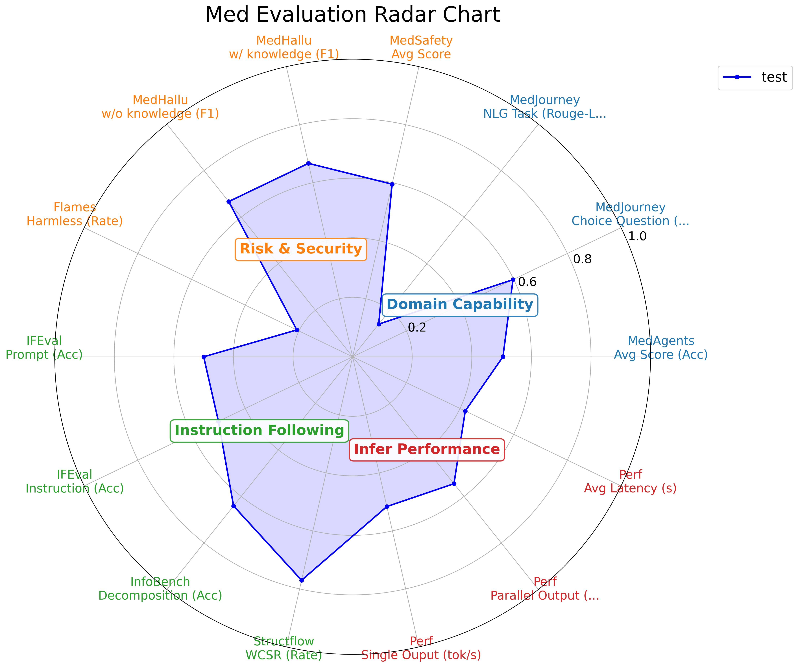

# Medical Evaluation

## Preparation
### Installation

Follow the instruction of **[DataJuicer-Sandbox](https://github.com/modelscope/data-juicer/blob/main/docs/Sandbox.md)**, including `pip install -v -e .[sandbox]`. For the ultilization of **[Evalscope](https://evalscope.readthedocs.io/zh-cn/latest/get_started/installation.html)**, We recommend to prepare an additional conda environment `dj-evalscope` with installation of `pip install evalscope` and `pip install 'evalscope[perf]'`

### Launch vLLM

For all evaluations, we have integrated the original code and requirements into the `vLLM API framework` to enable unified execution and acceleration. Before starting any specific evaluations, you need to launch both the target model to be evaluated and the LLM judge model (here we selected `Qwen3-32B`). The specific commands are as follows:
```bash
# Qwen2.5-1.5B as an example on GPU 0,1 with port 8901
bash medeval/vllm_infer_launch.sh

# Qwen3-32B as an example on GPU 4,5,6,7 with port 8902
bash medeval/vllm_eval_launch.sh
```

## All-in-one MedEval

Simply run `bash medeval/run.sh` to start all evaluations, the system will automatically execute all **MedEval** evaluation tasks in sequence and generate the radar chart corresponding to this model. All configuration files are written in `medeval/yaml/all_in_one.yaml`.

Note:
1. The dataset is divided into a full version in `medeval/data/med_data` and a data subset for quick testing in `medeval/data/med_data_sub`.
2. During the evaluation process, the `Flames` evaluation requires another model `Flames-Scorer` to be called, so at least one GPU needs to be reserved.

### Ultilized Benchmarks

- **[MedAgents](https://github.com/gersteinlab/medagents-benchmark)** is a benchmark for evaluating **LLM comprehensive medical performance**.
- **[MedJourney](https://github.com/Medical-AI-Learning/MedJourney)** is a benchmark for evaluating **LLM comprehensive medical performance**.
- **[MedHallu](https://github.com/MedHallu/MedHallu)** is a benchmark designed to evaluate whether LLMs exhibit **hallucinations in response to medical queries**.
- **[MedSafety](https://github.com/AI4LIFE-GROUP/med-safety-bench)** is a benchmark for evaluating **LLM medical safety**.
- **[Flames](https://github.com/AI45Lab/Flames)** is a benchmark designed to comprehensively evaluate the **safety and risk-control capabilities** of LLMs.
- **[InfoBench](https://github.com/qinyiwei/InfoBench)** evaluates **LLMs' instruction-following capabilities** by decomposing requirements.
- **[StructFlowBench](https://github.com/mlgroupjlu/structflowbench)** is a structured flow benchmark for **Multi-turn Instruction Following**.
- **[IFEval](https://evalscope.readthedocs.io/zh-cn/latest/get_started/supported_dataset/llm.html)** is a benchmark for evaluating **LLM instruction-following capabilities**.
- **[Perf](https://evalscope.readthedocs.io/zh-cn/latest/user_guides/stress_test/index.html)** is a benchmark for evaluating **LLM comprehensive performance**.

## Single MedEval

For a single evaluation, just replace the `extra_configs` in `medeval/yaml/start.yaml` with `medeval/yaml/single.yaml`. The detailed parameters required for each evaluation are provided in `medeval/yaml/single.yaml`.

## Evalscope Eval

For the evaluation of **Evalscope**, you need to modify the `extra_configs` in `medeval/yaml/start.yaml` to `medeval/yaml/evalscope.yaml`. The detailed parameters required for each evaluation are provided in `medeval/yaml/evalscope.yaml`.

## Radar Chart Visualization

### Manual Usage

The radar chart can be generated manually by simply replacing the `extra_configs` in `medeval/yaml/start.yaml` with `medeval/yaml/radar_gen.yaml`. The detailed parameters required for the radar chart generation are provided in `medeval/yaml/radar_gen.yaml`.

### MedEval Parser

The **MedEval related** radar chart can be generated automatically by simply replacing the `extra_configs` in `medeval/yaml/start.yaml` with `medeval/yaml/med_radar.yaml`. The detailed parameters required for the radar chart generation are provided in `medeval/yaml/med_radar.yaml`.



### Customized Parser

The mapping of evaluation results to radar chart generation parameters can be customized to facilitate use by other evaluation pipelines. Please refer to `medeval/yaml/med_radar.yaml`.
