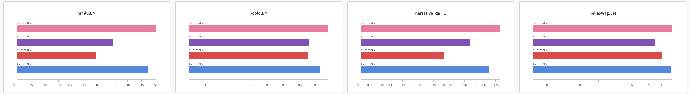

# Evaluation Results Recorder

Record your evaluation results to [W&B](https://wandb.ai/) (wandb) with [`wandb_writer.py`](wandb_writer.py).

With `wandb_writer.py`, you can:

- visualize the changes of evaluation metrics of your model during the training process

- make a leaderboard to compare the metrics of different models


## Usage

```shell
python wandb_writer.py --config <config_file> [--print-only]
```

- `config_file`: path to the configuration file (see [Configuration](#configuration) for details)
- `--print-only`: only print the result to command line, do not write to wandb

## Configuration

We provided three example files in [`config`](config) folder for three different cases.

The general format is as follows:

```yaml
project: <str>   # your wandb project name
base_url: <str>  # your wandb instance url
# other specific configuration items
```

### Parse from HELM output

The following configuration is used to parse evaluation results from HELM output folder and record them to wandb.

```yaml
# general configurations
# ...

evals:  # evaluations to record
  - eval_type: helm    # only support helm for now
    model_name: <str>  # your model name
    source: helm  # use helm to parse from helm output directory
    helm_output_dir: <your helm output dir path>
    helm_suite_name: <your helm suite name>
    token_per_iteration: <tokens per iteration in billions>
    benchmarks:  # benchmark metrics to be recorded, and below are some examples
      - name: mmlu
        metrics:
          - EM
      - name: boolq
        metrics:
          - EM
      - name: narrative_qa
        metrics:
          - F1
      - name: hellaswag
        metrics:
          - EM
      - ...
```

> We use 16 core metrics of HELM as the default benchmarks if the `benchmarks` field is not provided, the 16 metrics are as follows:
>  ```
>  mmlu.EM, raft.EM, imdb.EM, truthful_qa.EM, summarization_cnndm.ROUGE-2, summarization_xsum.ROUGE-2, boolq.EM, msmarco_trec.NDCG@10, msmarco_regular.RR@10, narrative_qa.F1, natural_qa_closedbook.F1, natural_qa_openbook_longans.F1, civil_comments.EM, hellaswag.EM, openbookqa.EM
>  ```

### Parse from configuration file

The scores of metrics can be given directly in the configuration file, the following is an example.

```yaml
# general configurations
# ...

evals:  # evaluations to record
  - eval_type: helm
    model_name: llama-7B  # your model name
    source: file  # use file to parse from configuration
    token_num: 1000
    eval_result:  # evaluation results to be recorded
      mmlu:
        EM: 0.345
      boolq:
        EM: 0.751
      narrative_qa:
        F1: 0.524
      hellaswag:
        EM: 0.747
      ...
```

### Make leaderboard

The following configuration is used to make a leaderboard.

```yaml
# general configurations
# ...
leaderboard: True
leaderboard_metrics:  # metrics required for the leaderboard
  - mmlu.EM
  - boolq.EM
  - quac.F1
  - hellaswag.EM
  - ...
excluded_models:   # models that do not participate in the leaderboard
  - <model to exclude>
  - ...
```

> We use 16 core metrics of HELM as the default leaderboard metrics if the `leaderboard_metrics` field is not provided, the 16 metrics are as same as the default benchmark metrics.
