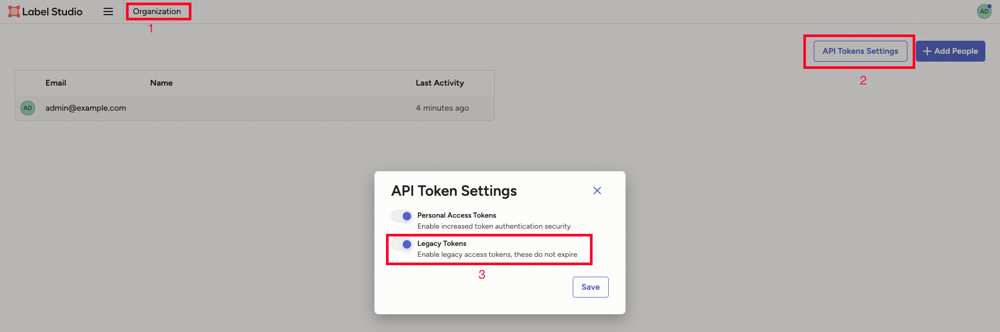

# Label Studio Service Utility

This utility script (`label_studio_service.py`) helps you manage a local Label Studio instance for development and testing, either via Docker or pip. It also provides automation for test project creation and connection info management.

## Features
- Start/stop Label Studio using Docker or pip
- Automatically create a test project and sample task
- Output connection details for use in other tools
- Clean up test projects after use

## Usage

```bash
python label_studio_service.py [--port PORT] [--create-test-project] [--use-pip]
```

### Key Options
- `--use-pip`: Run Label Studio using a local pip installation instead of Docker. This is useful if you want to avoid Docker or need to run Label Studio in a virtual environment.
- `--create-test-project`: Automatically creates a test project and a sample annotation task.

## Connection File: `label_studio_localhost_connection.json`
- When you run the script, it generates a `label_studio_localhost_connection.json` file in the current directory.
- This file contains connection details such as the API URL, API key, and project ID.
- **If this file is present, the credentials (API key, username, password, etc.) defined in it will be directly used by the script, overriding command-line arguments or defaults.**
- Other tools (like Data Juicer) can use this file to connect to the running Label Studio instance.
- If you delete this file, you will need to rerun the script to regenerate it.

## Enabling Legacy Token Authentication
- **Important:** To ensure proper API access, you must manually enable legacy token authentication in the Label Studio web portal after the instance is running.
- Go to the Label Studio admin interface, navigate to your organization settings, and turn on "Legacy token authentication".
- This is required for API access using the generated API token.


*To enable legacy token authentication in the Label Studio organization settings, follow these steps:*

1. Go to the **Organization** page in the Label Studio web interface.
2. Click on **API Token Settings**.
3. Enable the **Legacy Tokens** option.

## Label Studio Version
- The version of Label Studio used is specified in `requirements/minimal.txt`.
- If you use `--use-pip`, the script will install the version listed in `requirements/minimal.txt` (e.g., `label-studio==1.17.0`).
- For Docker, the default image tag is set to match the version in `requirements/minimal.txt`.

## Example

Start Label Studio on port 7070 using pip and create a test project:

```bash
python label_studio_service.py --use-pip --port 7070 --create-test-project
```

After startup, check the `label_studio_localhost_connection.json` file for connection details.

## Troubleshooting
- If you encounter API authentication errors, double-check that legacy token authentication is enabled in the Label Studio portal.
- If you change the Label Studio version in `requirements/minimal.txt`, rerun the script to update your environment.

---
For more details, see the script's inline documentation or run `python label_studio_service.py --help`. 